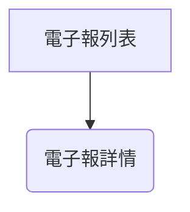

# BMad DiCaster UI/UX 規格書

## 簡介

本文件定義了 BMad DiCaster 使用者介面的使用者體驗目標、資訊架構、使用者流程以及視覺設計規格。

- **主要設計檔案連結：** N/A (下方描述了低擬真線框稿；詳細的模擬圖將在開發過程中創建)
- **已部署 Storybook / 設計系統連結：** N/A (下方為基本組件定義；完整的設計系統不在 MVP 範疇內)

## 整體 UX 目標與原則

- **目標使用者畫像：** 主要使用者：一位開發者兼 Hacker News 愛好者，希望每日快速概覽熱門 HN 文章。

  - 主要需求是節省時間並有效率地獲取 HN 內容。

- **易用性目標：** 效率：

  - UI 應能讓使用者快速掃描每日摘要。
  - 存取完整文章和 podcast 版本應直接明瞭。

- **設計原則：**
  - 極簡主義：乾淨的版面配置，僅顯示必要資訊以避免混亂。
  - 清晰度：易讀的字體排印和清晰的視覺層次。
  - 速度：快速的載入時間和迅速的內容存取。
  - Synthwave 美學：透過色彩強調和字體排印融入視覺主題。

## 資訊架構 (IA)

- **網站地圖 / 畫面清單：**



- **導覽結構：**
  - 主要導覽：從「電子報列表」頁面到所選電子報的「電子報詳情」頁面的簡單連結。
  - 次要導覽：
    - 在「電子報詳情」頁面，包含一個「返回列表」的連結/按鈕。

## 使用者流程

### 檢視電子報

- **目標：** 閱讀特定每日電子報的內容。
- **步驟 / 圖表：**

<!-- end list -->

```mermaid
graph TD
    A[電子報列表頁面] --> B(選擇電子報);
    B --> C[電子報詳情頁面];
    C --> D{閱讀電子報};
    C --> E{下載電子報 (可選)};
    C --> F{收聽 Podcast (可選)};
    C --> G{返回列表 (可選)};
```

## 線框稿與模擬圖

- **電子報列表頁面：**
  - 描述：一個簡單的電子報列表，按日期排序 (最新優先)。每個列表項目包含電子報的標題/主旨和日期，並提供前往詳情頁面的導覽。
  - 關鍵元素：頁面標題 (「每日 DiCaster」或類似名稱)、電子報列表。
- **電子報詳情頁面：**
  - 描述：顯示所選電子報的完整內容。包含播放 podcast、下載電子報以及導覽回列表頁面的選項。
  - 關鍵元素：電子報標題、電子報內容、Podcast 播放器、下載按鈕、返回列表按鈕/連結。

## 組件庫 / 設計系統參考

- **NewsletterCard：**
  - 用於電子報列表頁面，顯示每份電子報的簡要摘要。
  - 包含電子報標題和日期。
  - 提供前往電子報詳情頁面的連結/按鈕。
- **PodcastPlayer：**
  - 用於電子報詳情頁面，嵌入並控制 podcast 播放。
- **DownloadButton：**
  - 用於電子報詳情頁面，允許使用者下載電子報。
- **BackButton：**
  - 用於電子報詳情頁面，導覽回電子報列表頁面。

## 品牌與風格指南參考

- **調色盤：** 使用 Tailwind 的預設調色盤，若有需要，可使用 `#800080` (紫色) 作為自訂強調色。
- **字體排印：** 使用 Tailwind 的預設字型家族 (sans-serif) 以及語義化類別來設定標題 (例如 `text-2xl font-bold`) 和內文 (例如 `text-base`)。
- **圖示：** 使用極簡風格的圖示集 (例如 Font Awesome)，並以 Tailwind 類別設定樣式。
- **間距與網格：** 使用 Tailwind 的工具類別來設定間距 (例如 `p-4`, `m-2`) 和網格版面配置 (例如 `grid`, `grid-cols-2`)。

## 無障礙 (AX) 需求

- **目標合規性：** WCAG 2.1 Level A
- **特定需求：**
  - 鍵盤導覽：確保所有互動元素 (連結、按鈕) 都能使用鍵盤聚焦和操作。
  - 語義化 HTML：使用適當的 HTML5 元素來表示結構和意義 (例如 `<nav>`, `<article>`, `<button>`)。
  - 替代文字：為圖片 (若有使用) 提供描述性的替代文字。
  - 色彩對比：確保文字和背景元素之間有足夠的色彩對比。

## 回應式設計

- **中斷點：** 使用 Tailwind 的預設中斷點：`sm`, `md`, `lg`, `xl`。
- **適應策略：** 使用 Tailwind 的回應式前綴 (`sm:`, `md:`, `lg:`, `xl:`) 在不同中斷點有條件地套用樣式。
  - 例如：
    - `text-base md:text-lg` (小螢幕上為基本字體大小，中等螢幕及以上則較大)。
    - `grid grid-cols-1 md:grid-cols-2` (小螢幕上為單欄網格，中等螢幕及以上則為雙欄網格)。

## 變更日誌

| 變更 | 日期       | 版本 | 描述             | 作者   |
| :--- | :--------- | :--- | :--------------- | :----- |
| 初稿 | 2025-05-13 | 0.1  | UI/UX 規格書初稿 | 4-arch |
