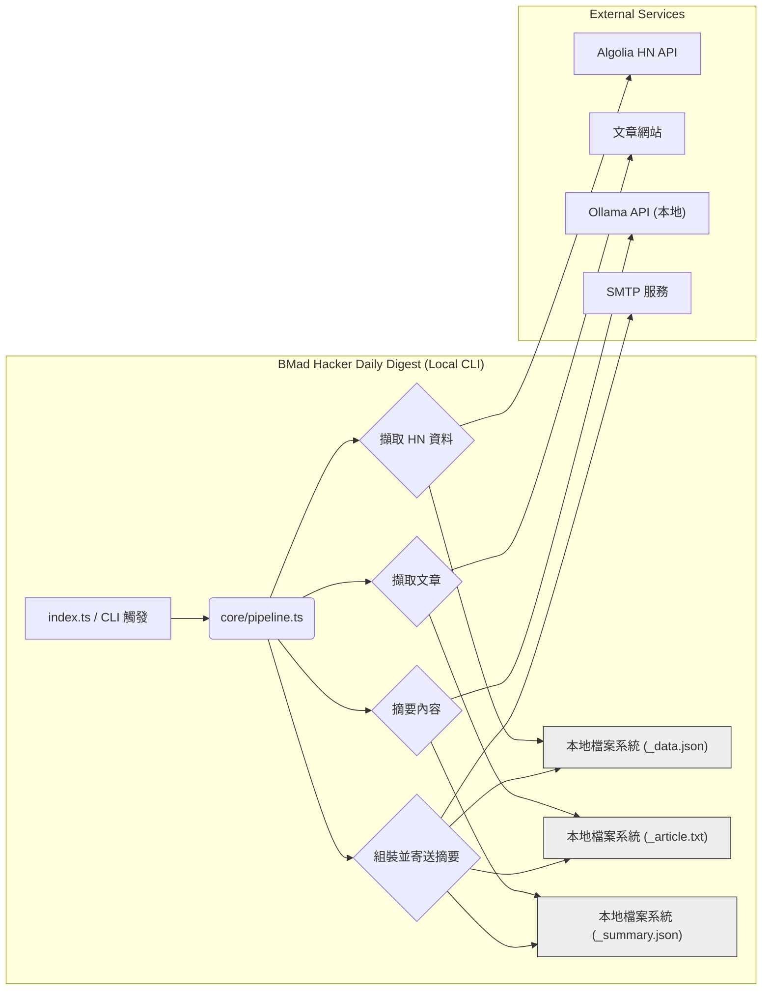
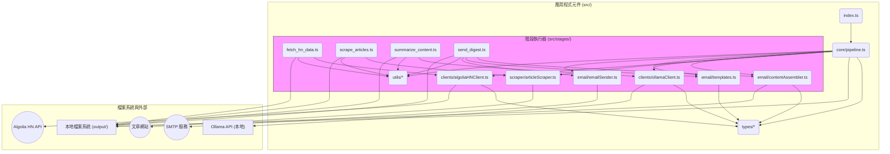
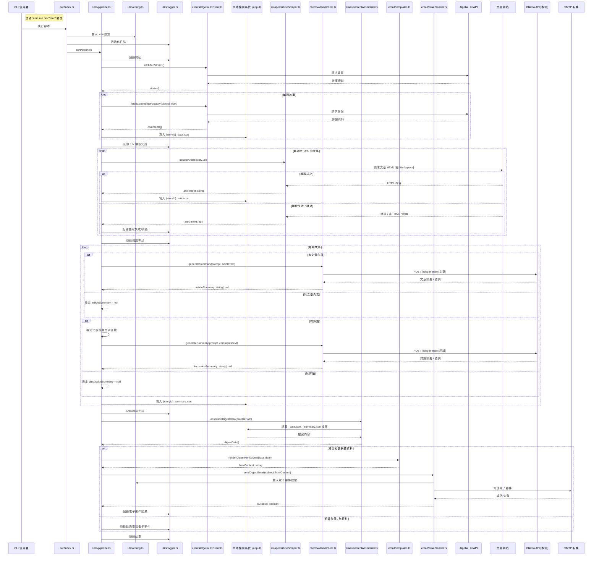

# BMad Hacker Daily Digest 架構文件

## 技術摘要

BMad Hacker Daily Digest 是一個命令列介面（CLI）工具，旨在為使用者提供頂尖 Hacker News（HN）故事及其相關評論討論的簡明摘要。此工具使用 TypeScript 與 Node.js（v22）構建，完全在使用者本機運行。核心功能包含一個順序管線：從 Algolia HN Search API 擷取故事與評論資料，嘗試擷取連結文章內容，利用本地 Ollama LLM 實例生成摘要，將中間資料持久化至本地檔案系統，最後組裝並以 Nodemailer 寄送 HTML 摘要。架構強調模組化與可測試性，包含強制的獨立腳本以測試每個管線階段。專案起始於 `bmad-boilerplate` 範本。

## 高階概述

應用程式遵循簡單的順序管線架構，透過手動 CLI 指令（`npm run dev` 或 `npm start`）執行。無持久化資料庫；使用本地檔案系統儲存不同步驟間的中間資料產物（擷取資料、擷取文字、摘要），資料存放於日期標記的目錄中。所有外部 HTTP 通訊（Algolia API、文章擷取、Ollama API）皆使用 Node.js 原生 `Workspace` API。

## 元件視圖

應用程式程式碼（`src/`）依據定義的專案結構（`docs/project-structure.md`）組織成邏輯模組。主要元件包含：

- **`src/index.ts`**：主要入口點，處理 CLI 調用並啟動管線。
- **`src/core/pipeline.ts`**：協調主要管線階段（擷取、擷取文章、摘要、寄送）的順序執行。
- **`src/clients/`**：負責與外部 API 互動的模組。
  - `algoliaHNClient.ts`：與 Algolia HN Search API 通訊。
  - `ollamaClient.ts`：與本地 Ollama API 通訊。
- **`src/scraper/articleScraper.ts`**：處理從文章 URL 擷取並抽取文字內容。
- **`src/email/`**：管理摘要組裝、HTML 渲染及透過 Nodemailer 寄送電子郵件。
  - `contentAssembler.ts`：讀取持久化資料。
  - `templates.ts`：渲染 HTML。
  - `emailSender.ts`：寄送電子郵件。
- **`src/stages/`**：包含獨立腳本（`Workspace_hn_data.ts`、`scrape_articles.ts` 等），用於獨立測試各管線階段，必要時使用本地資料。
- **`src/utils/`**：共用工具，包含設定載入（`config.ts`）、日誌（`logger.ts`）與日期處理（`dateUtils.ts`）。
- **`src/types/`**：共用 TypeScript 介面與型別。

## 主要架構決策與模式

- **架構風格：** CLI 執行的簡單順序管線。
- **執行環境：** 僅限本地機器；MVP 無雲端部署與資料庫。
- **資料處理：** 中間資料持久化於日期標記的本地檔案系統目錄。
- **HTTP 客戶端：** 強制使用 Node.js v22 原生 `Workspace` API 進行所有外部 HTTP 請求。
- **模組化：** 程式碼依客戶端、擷取、電子郵件、核心邏輯、工具與型別等模組組織，促進職責分離與可測試性。
- **階段測試：** 強制獨立腳本（`src/stages/*`）允許獨立測試每個管線階段。
- **設定：** 環境變數原生從 `.env` 檔案載入；無需 `dotenv` 套件。
- **錯誤處理：** 擷取失敗時優雅處理（記錄並繼續）；其他 API/網路錯誤採基本日誌。
- **日誌：** MVP 採用簡單包裝的基本主控台日誌（`src/utils/logger.ts`）；結構化檔案日誌為後期考量。
- **主要函式庫：** `@extractus/article-extractor`、`date-fns`、`nodemailer`、`yargs`。（詳見 `docs/tech-stack.md`）

## 核心工作流程 / 序列圖（主管線）

## 基礎架構與部署概述

- **雲端供應商：** 無。於使用者本機執行。
- **核心服務使用情況：** 無（依賴外部 Algolia API、本地 Ollama、目標網站、SMTP 供應商）。
- **基礎架構即程式碼（IaC）：** 無。
- **部署策略：** 透過 CLI 手動執行（`npm run dev` 或 `npm run start`，先執行 `npm run build`）。MVP 無 CI/CD 管線需求。
- **環境：** 單一環境：本地開發機器。

## 重要參考文件

- `docs/prd.md`
- `docs/epic1.md` ... `docs/epic5.md`
- `docs/tech-stack.md`
- `docs/project-structure.md`
- `docs/data-models.md`
- `docs/api-reference.md`
- `docs/environment-vars.md`
- `docs/coding-standards.md`
- `docs/testing-strategy.md`
- `docs/prompts.md`

## 變更紀錄

| 變更     | 日期       | 版本 | 描述              | 作者        |
| -------- | ---------- | ---- | ----------------- | ----------- |
| 初始草稿 | 2025-05-04 | 0.1  | 根據 PRD 初始草稿 | 3-Architect |
