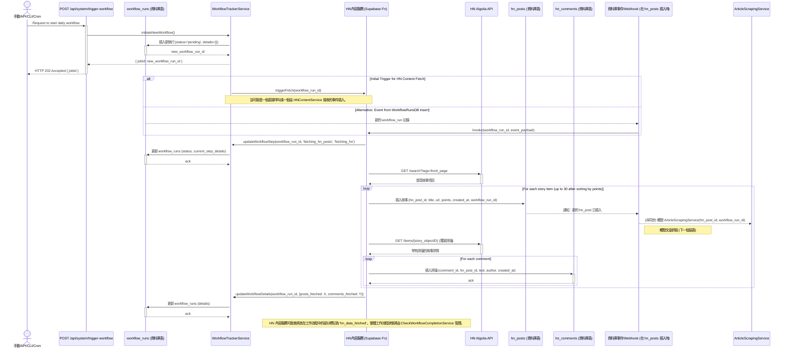

# BMad DiCaster 架構文件

## 引言 / 前言

本文件概述了 BMad DiCaster 的整體專案架構，包括後端系統、共享服務以及非 UI 特定的考量。其主要目標是作為 AI 驅動開發的指導性架構藍圖，確保一致性並遵循所選的模式和技術。

**與前端架構的關係：**
本專案包含一個重要的使用者介面。一份單獨的 Frontend Architecture Document (預期命名為 `frontend-architecture.md` 並在建立後連結至「關鍵參考文件」中) 將詳細說明前端特定的設計，並且必須與本文件一併使用。本文檔中記錄的核心技術堆疊選擇（參見「確定的技術堆疊選擇」）對整個專案（包括任何前端元件）都是確定的。

## 目錄

- [引言 / 前言](#引言--前言)
- [技術摘要](#技術摘要)
- [高層次概述](#高層次概述)
- [元件視圖](#元件視圖)
  - [採用的架構 / 設計模式](#採用的架構--設計模式)
- [工作流程協調與狀態管理](#工作流程協調與狀態管理)
- [專案結構](#專案結構)
  - [關鍵目錄說明](#關鍵目錄說明)
  - [Monorepo 管理](#monorepo-管理)
  - [備註](#備註)
- [API 參考](#api-參考)
  - [使用的外部 API](#使用的外部-api)
    - [1. Hacker News (HN) Algolia API](#1-hacker-news-hn-algolia-api)
    - [2. Play.ht API](#2-playht-api)
    - [3. LLM Provider (摘要的 Facade)](#3-llm-provider-摘要的-facade)
    - [4. Nodemailer (電子郵件傳遞服務)](#4-nodemailer-電子郵件傳遞服務)
  - [提供的內部 API (由 BMad DiCaster 提供)](#提供的內部-api-由-bmad-dicaster-提供)
    - [1. 工作流程觸發 API](#1-工作流程觸發-api)
    - [2. 工作流程狀態 API](#2-工作流程狀態-api)
    - [3. Play.ht Webhook 接收器](#3-playht-webhook-接收器)
- [資料模型](#資料模型)
  - [核心應用程式實體 / 領域物件](#核心應用程式實體--領域物件)
    - [1. `WorkflowRun`](#1-workflowrun)
    - [2. `HNPost`](#2-hnpost)
    - [3. `HNComment`](#3-hncomment)
    - [4. `ScrapedArticle`](#4-scrapedarticle)
    - [5. `ArticleSummary`](#5-articlesummary)
    - [6. `CommentSummary`](#6-commentsummary)
    - [7. `Newsletter`](#7-newsletter)
    - [8. `Subscriber`](#8-subscriber)
    - [9. `SummarizationPrompt`](#9-summarizationprompt)
    - [10. `NewsletterTemplate`](#10-newslettertemplate)
  - [資料庫 Schema (Supabase PostgreSQL)](#資料庫-schemas-supabase-postgresql)
    - [1. `workflow_runs`](#1-workflow_runs)
    - [2. `hn_posts`](#2-hn_posts)
    - [3. `hn_comments`](#3-hn_comments)
    - [4. `scraped_articles`](#4-scraped_articles)
    - [5. `article_summaries`](#5-article_summaries)
    - [6. `comment_summaries`](#6-comment_summaries)
    - [7. `newsletters`](#7-newsletters)
    - [8. `subscribers`](#8-subscribers)
    - [9. `summarization_prompts`](#9-summarization_prompts)
    - [10. `newsletter_templates`](#10-newsletter_templates)
- [核心工作流程 / 序列圖](#核心工作流程--序列圖)
  - [1. 每日工作流程啟動與 HN 內容獲取](#1-每日工作流程啟動與-hn-內容獲取)
  - [2. 文章抓取與摘要流程](#2-文章抓取與摘要流程)
  - [3. 電子報、Podcast 與傳遞流程](#3-電子報podcast-與傳遞流程)
- [確定的技術堆疊選擇](#確定的技術堆疊選擇)
- [基礎設施與部署概述](#基礎設施與部署概述)
- [錯誤處理策略](#錯誤處理策略)
- [程式碼標準](#程式碼標準)
  - [詳細語言與框架慣例](#詳細語言與框架慣例)
    - [TypeScript/Node.js (Next.js 與 Supabase Functions) 細節](#typescriptnodejs-nextjs-與-supabase-functions-細節)
- [整體測試策略](#整體測試策略)
- [安全最佳實踐](#安全最佳實踐)
- [關鍵參考文件](#關鍵參考文件)
- [變更日誌](#變更日誌)
- [給設計架構師的提示：前端架構定義](#給設計架構師的提示前端架構定義)

## 技術摘要

BMad DiCaster 是一個網頁應用程式，旨在提供每日精簡的 Hacker News (HN) 熱門文章摘要，以 HTML 電子報和可選的 AI 生成 podcast 形式傳遞，可透過 Next.js 網頁介面存取。該系統採用託管在 Vercel 上的無伺服器、事件驅動架構，Supabase 提供 PostgreSQL 資料庫服務和函數託管。關鍵元件包括用於 HN 內容檢索的服務、文章抓取（使用 Cheerio）、AI 驅動的摘要（透過可配置的 LLM facade 支援 Ollama/遠端 API）、podcast 生成 (Play.ht)、電子報生成 (Nodemailer) 和工作流程協調。該架構強調模組化、關注點的清晰分離（針對複雜函數的務實六邊形方法）和強大的錯誤處理，旨在實現高效開發，特別是由 AI 開發代理。

## 高層次概述

BMad DiCaster 應用程式將採用完全託管在 Vercel 上的**無伺服器、事件驅動架構**，Supabase 提供後端服務（資料庫和函數）。該專案將被建構成一個 **monorepo**，包含 Next.js 前端應用程式和後端 Supabase 函數。

核心資料處理流程設計為一個事件驅動的管道：

1.  排程機制 (Vercel Cron Job) 或手動觸發 (API/CLI) 啟動每日工作流程，建立一個 `workflow_run` job。
2.  檢索 Hacker News 文章和評論 (HN Algolia API) 並儲存在 Supabase 中。
3.  此資料插入會觸發一個 Supabase 函數（透過資料庫 webhook）來抓取連結的文章。
4.  成功的文章抓取和儲存會觸發進一步的 Supabase 函數，用於對文章和評論進行 AI 驅動的摘要。
5.  追蹤工作流程執行的摘要步驟完成情況，一旦滿足所有先決條件，就會觸發電子報生成服務。
6.  電子報內容會發送到 Play.ht API 以生成 podcast。
7.  Play.ht 會呼叫一個 webhook 通知我們的系統 podcast 已準備就緒，並提供 podcast URL。
8.  Supabase 中的電子報資料會更新 podcast URL。
9.  然後，在考慮 podcast 可用性（帶有延遲/重試邏輯）後，透過 Nodemailer 將電子報傳遞給訂閱者。
10. Next.js 前端允許使用者查看當前和過去的電子報並收聽 podcast。

這種事件驅動的方法，使用 Supabase Database Webhooks（透過 `pg_net` 或原生功能）觸發託管在 Vercel 上的 Supabase Functions，旨在建立一個彈性且可擴展的系統。它透過將長時間運行的流程分解為更小、非同步觸發的單元來緩解潛在的逾時問題。

下面是一個系統上下文圖，說明了主要服務和使用者互動：

```mermaid
graph TD
    actor Caller as 手動/API/CLI/Cron
    participant TriggerAPI as POST /api/system/trigger-workflow
    participant WorkflowRunsDB as workflow_runs (資料庫表)
    participant WorkflowTracker as WorkflowTrackerService
    participant HNContentService as HN內容服務 (Supabase Fn)
    participant HNAlgoliaAPI as HN Algolia API
    participant HNPostsDB as hn_posts (資料庫表)
    participant HNCommentsDB as hn_comments (資料庫表)
    participant EventTrigger1 as 資料庫事件/Webhook (在 hn_posts 插入時)

    Caller -- "觸發每日工作流程 (API/CLI/Cron)" --> TriggerAPI
    TriggerAPI->>+WorkflowTracker: initiateNewWorkflow()
    WorkflowTracker->>+WorkflowRunsDB: 插入新執行 (status='pending', details={})
    WorkflowRunsDB-->>-WorkflowTracker: new_workflow_run_id
    WorkflowTracker-->>TriggerAPI: { jobId: new_workflow_run_id }
    TriggerAPI-->>-Caller: HTTP 202 Accepted { jobId }

    alt Initial Trigger for HN Content Fetch
        WorkflowTracker->>+HNContentService: triggerFetch(workflow_run_id)
        Note over WorkflowTracker,HNContentService: 這可能是一個直接呼叫或一個由 HNContentService 接收的事件插入。
    else Alternative: Event from WorkflowRunsDB insert
        WorkflowRunsDB-->>EventTrigger1: 新的 workflow_run 記錄
        EventTrigger1->>+HNContentService: Invoke(workflow_run_id, event_payload)
    end

    HNContentService->>+WorkflowTracker: updateWorkflowStep(workflow_run_id, 'fetching_hn_posts', 'fetching_hn')
    WorkflowTracker->>+WorkflowRunsDB: 更新 workflow_runs (status, current_step_details)
    WorkflowRunsDB-->>-WorkflowTracker: ack

    HNContentService->>+HNAlgoliaAPI: GET /search?tags=front_page
    HNAlgoliaAPI-->>-HNContentService: 首頁故事項目

    loop For each story item (up to 30 after sorting by points)
        HNContentService->>+HNPostsDB: 插入故事 (hn_post_id, title, url, points, created_at, workflow_run_id)
        HNPostsDB-->>EventTrigger1: 通知：新的 hn_post 已插入
        EventTrigger1-->>ArticleScrapingService: (非同步) 觸發 ArticleScrapingService(hn_post_id, workflow_run_id)
        Note right of EventTrigger1: 觸發文章抓取 (下一個圖表)

        HNContentService->>+HNAlgoliaAPI: GET /items/{story_objectID} (獲取評論)
        HNAlgoliaAPI-->>-HNContentService: 帶有評論的故事詳情
        loop For each comment
            HNContentService->>+HNCommentsDB: 插入評論 (comment_id, hn_post_id, text, author, created_at)
            HNCommentsDB-->>-HNContentService: ack
        end
    end
    HNContentService->>+WorkflowTracker: updateWorkflowDetails(workflow_run_id, {posts_fetched: X, comments_fetched: Y})
    WorkflowTracker->>+WorkflowRunsDB: 更新 workflow_runs (details)
    WorkflowRunsDB-->>-WorkflowTracker: ack
    Note over HNContentService: HN 內容服務可能會將其在工作流程中的部分標記為 'hn_data_fetched'。整體工作流程狀態將由 CheckWorkflowCompletionService 管理。
```

## 元件視圖

BMad DiCaster 系統由幾個關鍵邏輯元件組成，主要實作為無伺服器函數（部署在 Vercel 上的 Supabase Functions）和一個 Next.js 前端應用程式。這些元件以事件驅動的方式協同工作。

```mermaid
graph TD
    subgraph FrontendApp [前端應用程式 (Next.js)]
        direction LR
        WebAppUI["網頁應用程式 UI (React 元件)"]
        APIServiceFE["API 服務 (前端 - Next.js Route Handlers)"]
    end

    subgraph BackendServices [後端服務 (Supabase Functions & 核心邏輯)]
        direction TB
        WorkflowTriggerAPI["工作流程觸發 API (/api/system/trigger-workflow)"]
        HNContentService["HN 內容服務 (Supabase Fn)"]
        ArticleScrapingService["文章抓取服務 (Supabase Fn)"]
        SummarizationService["摘要服務 (LLM Facade - Supabase Fn)"]
        PodcastGenerationService["Podcast 生成服務 (Supabase Fn)"]
        NewsletterGenerationService["電子報生成服務 (Supabase Fn)"]
        PlayHTWebhookHandlerAPI["Play.ht Webhook API (/api/webhooks/playht)"]
        CheckWorkflowCompletionService["檢查工作流程完成服務 (Supabase Cron Fn)"]
    end

    subgraph ExternalIntegrations [外部 API 與服務]
        direction TB
        HNAlgoliaAPI["Hacker News Algolia API"]
        PlayHTAPI["Play.ht API"]
        LLMProvider["LLM Provider (Ollama/遠端 API)"]
        NodemailerService["Nodemailer (電子郵件傳遞)"]
    end

    subgraph DataStorage [資料儲存 (Supabase PostgreSQL)]
        direction TB
        DB_WorkflowRuns["workflow_runs 表"]
        DB_Posts["hn_posts 表"]
        DB_Comments["hn_comments 表"]
        DB_Articles["scraped_articles 表"]
        DB_Summaries["article_summaries / comment_summaries 表"]
        DB_Newsletters["newsletters 表"]
        DB_Subscribers["subscribers 表"]
        DB_Prompts["summarization_prompts 表"]
        DB_NewsletterTemplates["newsletter_templates 表"]
    end

    UserWeb[終端使用者] --> WebAppUI
    WebAppUI --> APIServiceFE
    APIServiceFE --> WorkflowTriggerAPI
    APIServiceFE --> DataStorage


    DevAdmin[開發者/管理員/Cron] --> WorkflowTriggerAPI

    WorkflowTriggerAPI --> DB_WorkflowRuns

    DB_WorkflowRuns -- "觸發 (透過 CheckWorkflowCompletion 或直接)" --> HNContentService
    HNContentService --> HNAlgoliaAPI
    HNContentService --> DB_Posts
    HNContentService --> DB_Comments
    HNContentService --> DB_WorkflowRuns


    DB_Posts -- "觸發 (透過 DB Webhook)" --> ArticleScrapingService
    ArticleScrapingService --> DB_Articles
    ArticleScrapingService --> DB_WorkflowRuns

    DB_Articles -- "觸發 (透過 DB Webhook)" --> SummarizationService
    SummarizationService --> LLMProvider
    SummarizationService --> DB_Prompts
    SummarizationService --> DB_Summaries
    SummarizationService --> DB_WorkflowRuns

    CheckWorkflowCompletionService -- "監控並根據...觸發下一步" --> DB_WorkflowRuns
    CheckWorkflowCompletionService -- "監控並根據...觸發下一步" --> DB_Summaries
    CheckWorkflowCompletionService -- "監控並根據...觸發下一步" --> DB_Newsletters


    CheckWorkflowCompletionService --> NewsletterGenerationService
    NewsletterGenerationService --> DB_NewsletterTemplates
    NewsletterGenerationService --> DB_Summaries
    NewsletterGenerationService --> DB_Newsletters
    NewsletterGenerationService --> DB_WorkflowRuns


    CheckWorkflowCompletionService --> PodcastGenerationService
    PodcastGenerationService --> PlayHTAPI
    PodcastGenerationService --> DB_Newsletters
    PodcastGenerationService --> DB_WorkflowRuns

    PlayHTAPI -- "Webhook" --> PlayHTWebhookHandlerAPI
    PlayHTWebhookHandlerAPI --> DB_Newsletters
    PlayHTWebhookHandlerAPI --> DB_WorkflowRuns


    CheckWorkflowCompletionService -- "觸發傳遞" --> NewsletterGenerationService
    NewsletterGenerationService -- "(用於傳遞)" --> NodemailerService
    NewsletterGenerationService -- "(用於傳遞)" --> DB_Subscribers
    NewsletterGenerationService -- "(用於傳遞)" --> DB_Newsletters
    NewsletterGenerationService -- "(用於傳遞)" --> DB_WorkflowRuns


    classDef user fill:#9cf,stroke:#333,stroke-width:2px;
    classDef feapp fill:#f9d,stroke:#333,stroke-width:2px;
    classDef beapp fill:#cdf,stroke:#333,stroke-width:2px;
    classDef external fill:#ffc,stroke:#333,stroke-width:2px;
    classDef db fill:#cfc,stroke:#333,stroke-width:2px;

    class UserWeb,DevAdmin user;
    class FrontendApp,WebAppUI,APIServiceFE feapp;
    class BackendServices,WorkflowTriggerAPI,HNContentService,ArticleScrapingService,SummarizationService,PodcastGenerationService,NewsletterGenerationService,PlayHTWebhookHandlerAPI,CheckWorkflowCompletionService beapp;
    class ExternalIntegrations,HNAlgoliaAPI,PlayHTAPI,LLMProvider,NodemailerService external;
    class DataStorage,DB_WorkflowRuns,DB_Posts,DB_Comments,DB_Articles,DB_Summaries,DB_Newsletters,DB_Subscribers,DB_Prompts,DB_NewsletterTemplates db;
```

- **前端應用程式 (Next.js on Vercel)：**
  - **網頁應用程式 UI (React 元件)：** 渲染 UI，顯示電子報/podcast，處理使用者互動。
  - **API 服務 (前端 - Next.js Route Handlers)：** 處理前端發起的 API 呼叫（例如，用於未來的管理功能）並接收傳入的 webhooks (Play.ht)。
- **後端服務 (Supabase Functions & 核心邏輯)：**
  - **工作流程觸發 API (`/api/system/trigger-workflow`)：** 安全的 Next.js API 路由，用於手動啟動每日工作流程。
  - **HN 內容服務 (Supabase Fn)：** 從 HN Algolia API 檢索文章/評論，並儲存它們。
  - **文章抓取服務 (Supabase Fn)：** 由新的 HN 文章觸發，抓取文章內容。
  - **摘要服務 (LLM Facade - Supabase Fn)：** 由新的文章/評論觸發，使用 LLM 生成摘要。
  - **Podcast 生成服務 (Supabase Fn)：** 將電子報內容發送到 Play.ht API。
  - **電子報生成服務 (Supabase Fn)：** 編譯電子報，處理 podcast 連結邏輯，觸發電子郵件傳遞。
  - **Play.ht Webhook API (`/api/webhooks/playht`)：** Next.js API 路由，用於接收來自 Play.ht 的 podcast 狀態。
  - **檢查工作流程完成服務 (Supabase Cron Fn)：** 定期監控 `workflow_runs` 和相關表格，以協調管道階段之間的進展（例如，從摘要到電子報生成，然後到傳遞）。
- **資料儲存 (Supabase PostgreSQL)：** 儲存所有應用程式資料，包括工作流程狀態、內容、摘要、電子報、訂閱者、提示和模板。
- **外部 API 與服務：** HN Algolia API, Play.ht API, LLM Provider (Ollama/遠端), Nodemailer。

### 採用的架構 / 設計模式

- **事件驅動架構：** 核心後端處理是一系列由資料庫事件（Supabase Database Webhooks 呼叫託管在 Vercel 上的 Supabase Functions）觸發的步驟，並透過 `workflow_runs` 表和 `CheckWorkflowCompletionService` 進行協調。
- **無伺服器函數：** 後端邏輯封裝在 Supabase Functions 中（運行在 Vercel 上）。
- **Monorepo：** 所有程式碼都位於單一儲存庫中。
- **Facade 模式：** 將與外部服務 (HN API, Play.ht API, LLM, Nodemailer) 的互動封裝在 `supabase/functions/_shared/` 中。
- **Factory 模式 (用於 LLM 服務)：** `LLMFacade` 將使用一個 factory 根據環境配置實例化適當的 LLM 客戶端。
- **六邊形架構 (務實應用)：** 對於複雜的 Supabase Functions，核心業務邏輯將與框架特定的處理程式和資料互動程式碼（adapters）分離，以提高可測試性和可維護性。較簡單的函數可能會有更直接的實作。
- **Repository 模式 (用於資料存取 - 概念性)：** 服務中的資料存取邏輯將被組織起來，概念上類似於 repositories，即使在 MVP Supabase Functions 中沒有嚴格地為所有實體實作單獨的 repository 類別。
- **透過環境變數進行配置：** 所有敏感和環境特定的配置都透過環境變數進行管理。

## 工作流程協調與狀態管理

BMad DiCaster 應用程式採用事件驅動的管道進行每日內容處理。為了管理、監控並確保這個多步驟工作流程的穩健執行，實作了以下協調策略：

**1. 中央工作流程追蹤 (`workflow_runs` 表)：**

- 一個專用表格 `public.workflow_runs`（在資料模型中定義）作為每個啟動的每日工作流程狀態和進度的單一事實來源。
- 每個工作流程執行都由該表格中的唯一 `id` (jobId) 識別。
- 關鍵欄位包括 `status`、`current_step_details`、`error_message` 和一個 `details` JSONB 欄位，用於儲存元資料和進度計數器（例如，`posts_fetched`、`articles_scraped_successfully`、`summaries_generated`、`podcast_playht_job_id`、`podcast_status`）。

**2. 工作流程啟動：**

- 工作流程透過 `POST /api/system/trigger-workflow` API 端點啟動（可手動、透過 CLI 或 cron job 呼叫）。
- 成功觸發後，會在 `workflow_runs` 中建立一個新記錄，初始狀態為（例如，'pending' 或 'fetching_hn'），並將 `jobId` 返回給呼叫者。
- 此初始記錄建立會透過資料庫 webhook 或從觸發 API 邏輯的初始直接呼叫觸發管道中的第一個服務 (`HNContentService`)。

**3. 服務函數職責：**

- 參與工作流程的每個後端 Supabase Function (`HNContentService`、`ArticleScrapingService`、`SummarizationService`、`PodcastGenerationService`、`NewsletterGenerationService`) **必須**：
  - 知道它正在處理的 job 的 `workflow_run_id`。此 ID 應根據觸發事件/資料傳遞或檢索。
  - **在開始其主要任務之前：** 更新當前 `workflow_run_id` 的 `workflow_runs` 表，以反映其 `current_step_details`（例如，「開始為工作流程 Y 抓取文章 X」）。
  - **成功完成任務後：**
    - 更新任何相關資料表（例如，`scraped_articles`、`article_summaries`）。
    - 使用相關輸出或計數器（例如，增加 `articles_scraped_successfully_count`）更新 `workflow_runs.details` JSONB 欄位。
  - **失敗時：** 更新 `workflow_runs` 表，將 `status` 設定為 'failed'，並使用失敗資訊填充 `error_message` 和 `current_step_details`。
  - 利用共享的 `WorkflowTrackerService`（參見第 5 點）進行一致的狀態更新。
- `PlayHTWebhookHandlerAPI` (Next.js API 路由) 更新 `newsletters` 表，然後使用 podcast 狀態更新 `workflow_runs.details`。

**4. 協調與進展 (`CheckWorkflowCompletionService`)：**

- 一個專用的 Supabase Function `CheckWorkflowCompletionService` 將被排程定期運行（例如，透過 Vercel Cron Jobs 呼叫此服務的專用 HTTP 端點，或如果偏好以 DB 為中心的排程，則透過 Supabase 的 `pg_cron`，每 5-10 分鐘運行一次）。
- 此服務透過以下方式協調主要階段之間的進展：
  - 查詢處於中間狀態的 job 的 `workflow_runs`。
  - 透過以下方式驗證下一階段的所有先決任務是否已完成：
    - 根據 `workflow_run_id` 查詢相關資料表（例如，`scraped_articles`、`article_summaries`、`comment_summaries`）。
    - 檢查預期計數與實際完成計數（例如，所有 intended for summarization 的文章都有當前 `workflow_run_id` 的 `article_summaries` 條目）。
    - 在繼續進行電子郵件傳遞之前，檢查 `newsletters` 表中 podcast 生成的狀態（連結到 `workflow_run_id`）。
  - 如果滿足下一階段的條件，它會更新 `workflow_runs.status`（例如，更新為 'generating_newsletter'），然後呼叫適當的下一個服務（例如，`NewsletterGenerationService`），並傳遞 `workflow_run_id`。

**5. 共享的 `WorkflowTrackerService`：**

- 一個工具服務 `WorkflowTrackerService` 將在 `supabase/functions/_shared/` 中建立。
- 它將為所有後端函數提供標準化方法，以便與 `workflow_runs` 表互動（例如，`updateWorkflowStep()`、`incrementWorkflowDetailCounter()`、`failWorkflow()`、`completeWorkflowStep()`）。
- 這促進了狀態更新的一致性並減少了冗餘程式碼。

**6. 電子郵件傳遞前的 Podcast 連結：**

- `NewsletterGenerationService` 在生成 HTML 並啟動 podcast 建立（透過 `PodcastGenerationService`）後，會將 `newsletters.podcast_status` 設定為 'generating'。
- `CheckWorkflowCompletionService`（或如果設計用於輪詢/延遲，則為 `NewsletterGenerationService` 本身）將監控 `newsletters.podcast_url`（由 `PlayHTWebhookHandlerAPI` 填充）或 `newsletters.podcast_status`。
- 一旦 podcast URL 可用、達到逾時或 podcast 生成失敗（根據 PRD 的延遲/重試邏輯），`CheckWorkflowCompletionService` 會觸發電子郵件傳遞。最終的傳遞狀態將在 `workflow_runs` 和 `newsletters` 中更新。

## 專案結構

BMad DiCaster 專案組織為一個 monorepo，利用 Vercel/Supabase Next.js App Router 模板作為其基礎。

```plaintext
{project-root}/
├── app/                        # Next.js App Router
│   ├── (api)/                  # API route handlers
│   │   ├── system/
│   │   │   ├── trigger-workflow/route.ts
│   │   │   └── workflow-status/[jobId]/route.ts
│   │   └── webhooks/
│   │       └── playht/route.ts
│   ├── components/             # 應用程式特定的 UI react 元件
│   │   └── core/               # 例如，NewsletterCard, PodcastPlayer
│   ├── newsletters/
│   │   ├── [newsletterId]/page.tsx
│   │   └── page.tsx
│   ├── auth/                   # Auth 相關頁面和元件 (來自模板)
│   │   ├── login/page.tsx          # 登入頁面 (來自模板)
│   ├── layout.tsx
│   └── page.tsx                # 首頁
├── components/                 # Shadcn UI 元件根目錄 (根據 components.json 配置)
│   ├── tutorial/               # 範例/模板元件 (可移除)
│   ├── typography/             # 範例/模板元件 (可移除)
│   └── ui/                     # 基本 UI 元素 (button.tsx, card.tsx 等)
├── docs/                       # 專案文件
│   ├── prd.md                  # 或 prd-incremental-full-agile-mode.txt
│   ├── architecture.md         # 本文件
│   ├── ui-ux-spec.md           # 或 ui-ux-spec.txt
│   ├── technical-preferences.md # 或 technical-preferences copy.txt
│   ├── ADR/                    # 架構決策記錄 (視需要建立)
│   └── environment-vars.md     # (待建立)
├── lib/                        # 前端通用工具函數 (例如，來自模板的 utils.ts)
│   └── utils.ts
├── supabase/                   # Supabase 特定專案檔案 (後端邏輯)
│   ├── functions/              # Supabase Edge Functions (用於事件驅動管道)
│   │   ├── hn-content-service/index.ts
│   │   ├── article-scraper-service/index.ts
│   │   ├── summarization-service/index.ts
│   │   ├── podcast-generation-service/index.ts
│   │   ├── newsletter-generation-service/index.ts
│   │   ├── check-workflow-completion-service/index.ts # Cron 觸發的協調器
│   │   └── _shared/            # 共享工具/facades 用於 Supabase 後端函數
│   │       ├── supabase-admin-client.ts
│   │       ├── llm-facade.ts
│   │       ├── playht-facade.ts
│   │       ├── nodemailer-facade.ts
│   │       └── workflow-tracker-service.ts # 用於更新 workflow_runs 表
│   ├── migrations/             # 資料庫 schema 遷移
│   │   └── YYYYMMDDHHMMSS_initial_schema.sql
│   └── config.toml             # Supabase 專案配置 (用於 CLI)
├── public/                     # 靜態資源 (圖片, favicon 等)
├── shared/                     # 前端和 Supabase 函數之間共享的程式碼/類型
│   └── types/
│       ├── api-schemas.ts      # app/(api) 路由的請求/響應類型
│       ├── domain-models.ts    # 核心實體類型 (HNPost, ArticleSummary 等)
│       └── index.ts            # 共享類型的 Barrel file
├── styles/                     # 全域樣式 (例如，用於 Tailwind base 的 globals.css)
├── tests/                      # 自動化測試
│   ├── e2e/                    # Playwright E2E 測試
│   │   ├── newsletter-view.spec.ts
│   │   └── playwright.config.ts
│   └── integration/            # 整合測試
│       └── api-trigger-workflow.integration.test.ts
│   # 單元測試與原始檔案共存，例如，app/components/core/MyComponent.test.tsx
├── utils/                      # 根工具 (來自模板)
│   └── supabase/               # 用於前端的 Supabase 輔助函數 (來自模板)
│       ├── client.ts           # 客戶端 Supabase 客戶端
│       ├── middleware.ts       # Next.js middleware 的邏輯
│       └── server.ts           # 伺服器端 Supabase 客戶端
├── .env.example
├── .gitignore
├── components.json             # Shadcn UI 配置
├── middleware.ts               # Next.js middleware (根目錄，使用 utils/supabase/middleware.ts)
├── next-env.d.ts
├── next.config.mjs
├── package.json
├── postcss.config.js
├── README.md
├── tailwind.config.ts
└── tsconfig.json
```

### 關鍵目錄說明：

- **`app/`**：Next.js 前端（頁面、UI 元件、Next.js API 路由）。
  - **`app/(api)/`**：託管在 Vercel 上的後端 API 路由，包括 webhook 接收器和系統觸發器。
  - **`app/components/core/`**：應用程式特定的可重用 React 元件。
- **`components/`**：Shadcn UI 元件的根目錄。
- **`docs/`**：所有專案文件。
- **`lib/`**：前端特定的工具函數。
- **`supabase/functions/`**：後端無伺服器函數（事件驅動管道步驟）。
  - **`supabase/functions/_shared/`**：這些後端函數的工具和 facades，包括 `WorkflowTrackerService`。
- **`supabase/migrations/`**：由 Supabase CLI 管理的資料庫遷移。
- **`shared/types/`**：前端和 `supabase/functions/` 之間共享的 TypeScript 類型/介面。路徑別名 `@shared/*` 將在 `tsconfig.json` 中配置。
- **`tests/`**：包含 E2E 和整合測試。單元測試與原始檔案共存。
- **`utils/supabase/`**：由入門模板提供的前端專用 Supabase 客戶端輔助函數。

### Monorepo 管理：

- 標準 `npm`（或如果稍後採用 `pnpm`/`yarn` workspaces）用於管理依賴項。
- 根目錄的 `tsconfig.json` 包含路徑別名（`'*`'（參見下面的檔案內容），`@shared/*`）。

### 備註：

- `supabase/functions/` 中的 Supabase 函數透過 Supabase CLI 和 Vercel 整合部署到 Vercel。
- `CheckWorkflowCompletionService` 可能透過 Vercel Cron Job 呼叫該函數的簡單 HTTP 觸發端點來調用，或者如果偏好直接資料庫排程，則透過 `pg_cron` 來調用。

## API 參考

### 使用的外部 API

#### 1\. Hacker News (HN) Algolia API

- **目的：** 檢索 Hacker News 熱門文章及其相關評論。
- **基礎 URL：** Production: `http://hn.algolia.com/api/v1/`
- **驗證：** 無需驗證。
- **使用的關鍵端點：**
  - **`GET /search` (用於熱門文章)**
    - 說明：檢索目前在 Hacker News 首頁上的故事。
    - 請求參數：`tags=front_page`
    - 範例請求：`curl "http://hn.algolia.com/api/v1/search?tags=front_page"`
    - 後處理：應用程式按 `points`（降序）對獲取的故事進行排序，選擇最多前 30 個。
    - 成功響應 Schema (Code: `200 OK`)：標準 Algolia 搜尋響應，包含帶有故事物件的 'hits' 陣列。
      ```json
      {
        "hits": [
          {
            "objectID": "string",
            "created_at": "string",
            "title": "string",
            "url": "string",
            "author": "string",
            "points": "number",
            "story_text": "string",
            "num_comments": "number",
            "_tags": ["string"]
          }
        ],
        "nbHits": "number",
        "page": "number",
        "nbPages": "number",
        "hitsPerPage": "number"
      }
      ```
  - **`GET /items/{objectID}` (用於評論)**
    - 說明：透過其 `objectID` 檢索特定故事項目，以從 `children` 欄位獲取其完整的評論樹。為每個選定的熱門故事呼叫。
    - 成功響應 Schema (Code: `200 OK`)：標準 Algolia 項目響應。
      ```json
      {
        "id": "number",
        "created_at": "string",
        "author": "string",
        "text": "string",
        "parent_id": "number",
        "story_id": "number",
        "children": [
          {
            /* 嵌套評論結構 */
          }
        ]
      }
      ```
- **速率限制：** 對於公共使用來說很寬鬆；每日呼叫沒有問題。
- **官方文件連結：** [https://hn.algolia.com/api](https://hn.algolia.com/api)

#### 2\. Play.ht API

- **目的：** 生成電子報內容的 AI 驅動 podcast 版本。
- **基礎 URL：** Production: `https://api.play.ai/api/v1`
- **驗證：** API Key (`X-USER-ID` header) 和 Bearer Token (`Authorization` header)。儲存為 `PLAYHT_USER_ID` 和 `PLAYHT_API_KEY`。
- **使用的關鍵端點：**
  - **`POST /playnotes`**
    - 說明：啟動文字轉語音轉換。
    - 請求標頭：`Authorization: Bearer {PLAYHT_API_KEY}`、`X-USER-ID: {PLAYHT_USER_ID}`、`Content-Type: multipart/form-data`、`Accept: application/json`。
    - 請求主體 Schema：`multipart/form-data`
      - `sourceFile`：`string (binary)` (首選：將 HTML 電子報內容作為檔案上傳。)
      - `sourceFileUrl`：`string (uri)` (替代方案：如果 `sourceFile` 有問題，則提供託管電子報內容的 URL。)
      - `synthesisStyle`：`string` (必填，例如，"podcast")
      - `voice1`：`string` (必填，Voice ID)
      - `voice1Name`：`string` (必填)
      - `voice1Gender`：`string` (必填)
      - `webHookUrl`：`string (uri)` (必填，例如，`<YOUR_APP_DOMAIN>/api/webhooks/playht`)
    - **內容傳遞備註：** MVP 使用 `sourceFile`。如果出現問題，轉向 `sourceFileUrl`（例如，內容暫時儲存在 Supabase Storage 中）。
    - 成功響應 Schema (Code: `201 Created`)：
      ```json
      {
        "id": "string",
        "ownerId": "string",
        "name": "string",
        "sourceFileUrl": "string",
        "audioUrl": "string",
        "synthesisStyle": "string",
        "voice1": "string",
        "voice1Name": "string",
        "voice1Gender": "string",
        "webHookUrl": "string",
        "status": "string",
        "duration": "number",
        "requestedAt": "string",
        "createdAt": "string"
      }
      ```
- **Webhook 處理：** 端點 `/api/webhooks/playht` 接收來自 Play.ht 的 `POST`。
  - 請求主體 Schema (預期來自 Play.ht)：
    ```json
    { "id": "string", "audioUrl": "string", "status": "string" }
    ```
- **速率限制：** 取決於提供者。
- **官方文件連結：** [https://docs.play.ai/api-reference/playnote/post](https://docs.play.ai/api-reference/playnote/post)

#### 3\. LLM Provider (摘要的 Facade)

- **目的：** 為文章和評論串生成摘要。
- **配置：** 透過環境變數 (`LLM_PROVIDER_TYPE`、`OLLAMA_API_URL`、`REMOTE_LLM_API_KEY`、`REMOTE_LLM_API_URL`、`LLM_MODEL_NAME`)。
- **Facade 介面 (`LLMFacade` 在 `supabase/functions/_shared/llm-facade.ts` 中)：**

  ```typescript
  // 位於 supabase/functions/_shared/llm-facade.ts
  export interface LLMSummarizationOptions {
    prompt?: string;
    maxLength?: number;
  }

  export interface LLMFacade {
    generateSummary(
      textToSummarize: string,
      options?: LLMSummarizationOptions
    ): Promise<string>;
  }
  ```

- **實作：**
  - **本地 Ollama Adapter：** 對 `OLLAMA_API_URL` 發送 HTTP 請求。
    - 請求主體 (`/api/generate` 範例)：`{"model": "string", "prompt": "string", "stream": false}`
    - 響應主體 (範例)：`{"model": "string", "response": "string", ...}`
  - **遠端 LLM API Adapter：** 對 `REMOTE_LLM_API_URL` 發送已驗證的 HTTP 請求。Schemas 取決於提供者。
- **速率限制：** 取決於提供者。
- **官方文件連結：** Ollama: [https://github.com/ollama/ollama/blob/main/docs/api.md](https://www.google.com/search?q=https://github.com/ollama/ollama/blob/main/docs/api.md)

#### 4\. Nodemailer (電子郵件傳遞服務)

- **目的：** 發送生成的 HTML 電子報。
- **互動類型：** 透過 `supabase/functions/_shared/nodemailer-facade.ts` 中的 `NodemailerFacade` 在 `NewsletterGenerationService` 中進行函式庫整合。
- **配置：** 透過 SMTP 環境變數 (`SMTP_HOST`、`SMTP_PORT`、`SMTP_USER`、`SMTP_PASS`)。
- **關鍵操作：** 建立 transporter，建構電子郵件訊息 (From, To, Subject, HTML)，發送電子郵件。
- **官方文件連結：** [https://nodemailer.com/](https://nodemailer.com/)

### 提供的內部 API (由 BMad DiCaster 提供)

#### 1\. 工作流程觸發 API

- **目的：** 手動啟動每日內容處理管道。
- **端點路徑：** `/api/system/trigger-workflow` (Next.js API Route Handler)
- **方法：** `POST`
- **驗證：** `X-API-KEY` 標頭中的 API Key (與 `WORKFLOW_TRIGGER_API_KEY` 環境變數匹配)。
- **請求主體：** MVP：空或 `{}`。
- **成功響應 (`202 Accepted`)：** `{"message": "Daily workflow triggered successfully. Processing will occur asynchronously.", "jobId": "<UUID_of_the_workflow_run>"}`
- **錯誤響應：** `400 Bad Request`、`401 Unauthorized`、`500 Internal Server Error`。
- **動作：** 在 `workflow_runs` 表中建立記錄並啟動管道。

#### 2\. 工作流程狀態 API

- **目的：** 允許開發者/管理員檢查特定工作流程執行的狀態。
- **端點路徑：** `/api/system/workflow-status/{jobId}` (Next.js API Route Handler)
- **方法：** `GET`
- **驗證：** `X-API-KEY` 標頭中的 API Key。
- **請求參數：** `jobId` (路徑參數)。
- **成功響應 (`200 OK`)：**
  ```json
  {
    "jobId": "<UUID>",
    "createdAt": "timestamp",
    "lastUpdatedAt": "timestamp",
    "status": "string",
    "currentStep": "string",
    "errorMessage": "string?",
    "details": {
      /* 帶有步驟特定進度的 JSONB 物件 */
    }
  }
  ```
- **錯誤響應：** `401 Unauthorized`、`404 Not Found`、`500 Internal Server Error`。
- **動作：** 檢索給定 `jobId` 的 `workflow_runs` 記錄。

#### 3\. Play.ht Webhook 接收器

- **目的：** 接收來自 Play.ht 的狀態更新和 podcast 音訊 URL。
- **端點路徑：** `/api/webhooks/playht` (Next.js API Route Handler)
- **方法：** `POST`
- **驗證：** 實作驗證（例如，共享密鑰 token）。
- **請求主體 Schema (預期來自 Play.ht)：**
  ```json
  { "id": "string", "audioUrl": "string", "status": "string" }
  ```
- **成功響應 (`200 OK`)：** `{"message": "Webhook received successfully"}`
- **動作：** 更新 `newsletters` 和 `workflow_runs` 表。

## 資料模型

本節定義了 BMad DiCaster 應用程式中使用的核心資料結構，包括概念性領域實體及其在 Supabase PostgreSQL 中的對應資料庫 schema。

### 核心應用程式實體 / 領域物件

(概念性類型，通常定義在 `shared/types/domain-models.ts` 中)

#### 1\. `WorkflowRun`

- **說明：** 每日工作流程的單次執行。
- **Schema：** `id (string UUID)`、`createdAt (string ISO)`、`lastUpdatedAt (string ISO)`、`status (enum string: 'pending' | 'fetching_hn' | 'scraping_articles' | 'summarizing_content' | 'generating_podcast' | 'generating_newsletter' | 'delivering_newsletter' | 'completed' | 'failed')`、`currentStepDetails (string?)`、`errorMessage (string?)`、`details (object?: { postsFetched?: number, articlesAttempted?: number, articlesScrapedSuccessfully?: number, summariesGenerated?: number, podcastJobId?: string, podcastStatus?: string, newsletterGeneratedAt?: string, subscribersNotified?: number })`

#### 2\. `HNPost`

- **說明：** 一篇來自 Hacker News 的文章。
- **Schema：** `id (string HN_objectID)`、`hnNumericId (number?)`、`title (string)`、`url (string?)`、`author (string)`、`points (number)`、`createdAt (string ISO)`、`retrievedAt (string ISO)`、`hnStoryText (string?)`、`numComments (number?)`、`tags (string[]?)`、`workflowRunId (string UUID?)`

#### 3\. `HNComment`

- **說明：** HN 文章的評論。
- **Schema：** `id (string HN_commentID)`、`hnPostId (string)`、`parent_comment_id (string?)`、`author (string?)`、`text (string HTML)`、`createdAt (string ISO)`、`retrievedAt (string ISO)`、`children (HNComment[]?)`

#### 4\. `ScrapedArticle`

- **說明：** 從文章 URL 抓取的內容。
- **Schema：** `id (string UUID)`、`hnPostId (string)`、`originalUrl (string)`、`resolvedUrl (string?)`、`title (string?)`、`author (string?)`、`publicationDate (string ISO?)`、`mainTextContent (string?)`、`scrapedAt (string ISO)`、`scrapingStatus (enum string: 'pending' | 'success' | 'failed_unreachable' | 'failed_paywall' | 'failed_parsing')`、`errorMessage (string?)`、`workflowRunId (string UUID?)`

#### 5\. `ArticleSummary`

- **說明：** AI 生成的 `ScrapedArticle` 摘要。
- **Schema：** `id (string UUID)`、`scrapedArticleId (string UUID)`、`summaryText (string)`、`generatedAt (string ISO)`、`llmPromptVersion (string?)`、`llmModelUsed (string?)`、`workflowRunId (string UUID)`

#### 6\. `CommentSummary`

- **說明：** AI 生成的 `HNPost` 評論摘要。
- **Schema：** `id (string UUID)`、`hnPostId (string)`、`summaryText (string)`、`generatedAt (string ISO)`、`llmPromptVersion (string?)`、`llmModelUsed (string?)`、`workflowRunId (string UUID)`

#### 7\. `Newsletter`

- **說明：** 每日生成的電子報。
- **Schema：** `id (string UUID)`、`workflowRunId (string UUID)`、`targetDate (string YYYY-MM-DD)`、`title (string)`、`generatedAt (string ISO)`、`htmlContent (string)`、`mjmlTemplateVersion (string?)`、`podcastPlayhtJobId (string?)`、`podcastUrl (string?)`、`podcastStatus (enum string?: 'pending' | 'generating' | 'completed' | 'failed')`、`deliveryStatus (enum string: 'pending' | 'sending' | 'sent' | 'partially_failed' | 'failed')`、`scheduledSendAt (string ISO?)`、`sentAt (string ISO?)`

#### 8\. `Subscriber`

- **說明：** 電子郵件訂閱者。
- **Schema：** `id (string UUID)`、`email (string)`、`subscribedAt (string ISO)`、`isActive (boolean)`、`unsubscribedAt (string ISO?)`

#### 9\. `SummarizationPrompt`

- **說明：** 儲存用於 AI 摘要的提示。
- **Schema：** `id (string UUID)`、`promptName (string)`、`promptText (string)`、`version (string)`、`createdAt (string ISO)`、`updatedAt (string ISO)`、`isDefaultArticlePrompt (boolean)`、`isDefaultCommentPrompt (boolean)`

#### 10\. `NewsletterTemplate`

- **說明：** 電子報的 HTML/MJML 模板。
- **Schema：** `id (string UUID)`、`templateName (string)`、`mjmlContent (string?)`、`htmlContent (string)`、`version (string)`、`createdAt (string ISO)`、`updatedAt (string ISO)`、`isDefault (boolean)`

### 資料庫 Schema (Supabase PostgreSQL)

#### 1\. `workflow_runs`

```sql
CREATE TABLE public.workflow_runs (
    id UUID PRIMARY KEY DEFAULT gen_random_uuid(),
    created_at TIMESTAMPTZ NOT NULL DEFAULT now(),
    last_updated_at TIMESTAMPTZ NOT NULL DEFAULT now(),
    status TEXT NOT NULL DEFAULT 'pending', -- pending, fetching_hn, scraping_articles, summarizing_content, generating_podcast, generating_newsletter, delivering_newsletter, completed, failed
    current_step_details TEXT NULL,
    error_message TEXT NULL,
    details JSONB NULL -- {postsFetched, articlesAttempted, articlesScrapedSuccessfully, summariesGenerated, podcastJobId, podcastStatus, newsletterGeneratedAt, subscribersNotified}
);
COMMENT ON COLUMN public.workflow_runs.status IS '可能的值：pending, fetching_hn, scraping_articles, summarizing_content, generating_podcast, generating_newsletter, delivering_newsletter, completed, failed';
COMMENT ON COLUMN public.workflow_runs.details IS '儲存步驟特定的進度或元資料，例如 postsFetched, articlesScraped, podcastJobId 等。';
```

#### 2\. `hn_posts`

```sql
CREATE TABLE public.hn_posts (
    id TEXT PRIMARY KEY, -- HN 的 objectID
    hn_numeric_id BIGINT NULL UNIQUE,
    title TEXT NOT NULL,
    url TEXT NULL,
    author TEXT NULL,
    points INTEGER NOT NULL DEFAULT 0,
    created_at TIMESTAMPTZ NOT NULL, -- HN 文章建立時間
    retrieved_at TIMESTAMPTZ NOT NULL DEFAULT now(),
    hn_story_text TEXT NULL,
    num_comments INTEGER NULL DEFAULT 0,
    tags TEXT[] NULL,
    workflow_run_id UUID NULL REFERENCES public.workflow_runs(id) ON DELETE SET NULL -- 獲取此文章實例的執行
);
COMMENT ON COLUMN public.hn_posts.id IS '故事的 Hacker News objectID。';
```

#### 3\. `hn_comments`

```sql
CREATE TABLE public.hn_comments (
    id TEXT PRIMARY KEY, -- HN 的評論 ID
    hn_post_id TEXT NOT NULL REFERENCES public.hn_posts(id) ON DELETE CASCADE,
    parent_comment_id TEXT NULL REFERENCES public.hn_comments(id) ON DELETE CASCADE,
    author TEXT NULL,
    comment_text TEXT NOT NULL, -- 評論的 HTML 內容
    created_at TIMESTAMPTZ NOT NULL, -- HN 評論建立時間
    retrieved_at TIMESTAMPTZ NOT NULL DEFAULT now()
);
CREATE INDEX idx_hn_comments_post_id ON public.hn_comments(hn_post_id);
```

#### 4\. `scraped_articles`

```sql
CREATE TABLE public.scraped_articles (
    id UUID PRIMARY KEY DEFAULT gen_random_uuid(),
    hn_post_id TEXT NOT NULL REFERENCES public.hn_posts(id) ON DELETE CASCADE,
    original_url TEXT NOT NULL,
    resolved_url TEXT NULL,
    title TEXT NULL,
    author TEXT NULL,
    publication_date TIMESTAMPTZ NULL,
    main_text_content TEXT NULL,
    scraped_at TIMESTAMPTZ NOT NULL DEFAULT now(),
    scraping_status TEXT NOT NULL DEFAULT 'pending', -- pending, success, failed_unreachable, failed_paywall, failed_parsing
    error_message TEXT NULL,
    workflow_run_id UUID NULL REFERENCES public.workflow_runs(id) ON DELETE SET NULL
);
CREATE UNIQUE INDEX idx_scraped_articles_hn_post_id_workflow_run_id ON public.scraped_articles(hn_post_id, workflow_run_id);
COMMENT ON COLUMN public.scraped_articles.scraping_status IS '可能的值：pending, success, failed_unreachable, failed_paywall, failed_generic';
```

#### 5\. `article_summaries`

```sql
CREATE TABLE public.article_summaries (
    id UUID PRIMARY KEY DEFAULT gen_random_uuid(),
    scraped_article_id UUID NOT NULL REFERENCES public.scraped_articles(id) ON DELETE CASCADE,
    summary_text TEXT NOT NULL,
    generated_at TIMESTAMPTZ NOT NULL DEFAULT now(),
    llm_prompt_version TEXT NULL,
    llm_model_used TEXT NULL,
    workflow_run_id UUID NOT NULL REFERENCES public.workflow_runs(id) ON DELETE CASCADE
);
CREATE UNIQUE INDEX idx_article_summaries_scraped_article_id_workflow_run_id ON public.article_summaries(scraped_article_id, workflow_run_id);
COMMENT ON COLUMN public.article_summaries.llm_prompt_version IS '使用的摘要提示的版本或識別符。';
```

#### 6\. `comment_summaries`

```sql
CREATE TABLE public.comment_summaries (
    id UUID PRIMARY KEY DEFAULT gen_random_uuid(),
    hn_post_id TEXT NOT NULL REFERENCES public.hn_posts(id) ON DELETE CASCADE,
    summary_text TEXT NOT NULL,
    generated_at TIMESTAMPTZ NOT NULL DEFAULT now(),
    llm_prompt_version TEXT NULL,
    llm_model_used TEXT NULL,
    workflow_run_id UUID NOT NULL REFERENCES public.workflow_runs(id) ON DELETE CASCADE
);
CREATE UNIQUE INDEX idx_comment_summaries_hn_post_id_workflow_run_id ON public.comment_summaries(hn_post_id, workflow_run_id);
```

#### 7\. `newsletters`

```sql
CREATE TABLE public.newsletters (
    id UUID PRIMARY KEY DEFAULT gen_random_uuid(),
    workflow_run_id UUID NOT NULL UNIQUE REFERENCES public.workflow_runs(id) ON DELETE CASCADE,
    target_date DATE NOT NULL UNIQUE,
    title TEXT NOT NULL,
    generated_at TIMESTAMPTZ NOT NULL DEFAULT now(),
    html_content TEXT NOT NULL,
    mjml_template_version TEXT NULL,
    podcast_playht_job_id TEXT NULL,
    podcast_url TEXT NULL,
    podcast_status TEXT NULL DEFAULT 'pending', -- pending, generating, completed, failed
    delivery_status TEXT NOT NULL DEFAULT 'pending', -- pending, sending, sent, failed, partially_failed
    scheduled_send_at TIMESTAMPTZ NULL,
    sent_at TIMESTAMPTZ NULL
);
CREATE INDEX idx_newsletters_target_date ON public.newsletters(target_date);
COMMENT ON COLUMN public.newsletters.target_date IS '此電子報相關的日期。確保唯一性。';
```

#### 8\. `subscribers`

```sql
CREATE TABLE public.subscribers (
    id UUID PRIMARY KEY DEFAULT gen_random_uuid(),
    email TEXT NOT NULL UNIQUE,
    subscribed_at TIMESTAMPTZ NOT NULL DEFAULT now(),
    is_active BOOLEAN NOT NULL DEFAULT TRUE,
    unsubscribed_at TIMESTAMPTZ NULL
);
CREATE INDEX idx_subscribers_email_active ON public.subscribers(email, is_active);
```

#### 9\. `summarization_prompts`

```sql
CREATE TABLE public.summarization_prompts (
    id UUID PRIMARY KEY DEFAULT gen_random_uuid(),
    prompt_name TEXT NOT NULL UNIQUE,
    prompt_text TEXT NOT NULL,
    version TEXT NOT NULL DEFAULT '1.0',
    created_at TIMESTAMPTZ NOT NULL DEFAULT now(),
    updated_at TIMESTAMPTZ NOT NULL DEFAULT now(),
    is_default_article_prompt BOOLEAN NOT NULL DEFAULT FALSE,
    is_default_comment_prompt BOOLEAN NOT NULL DEFAULT FALSE
);
COMMENT ON COLUMN public.summarization_prompts.prompt_name IS '提示的唯一識別符，例如，article_summary_v2.1';
-- 應用程式邏輯將強制每種類型只有一個提示被標記為 default。
```

#### 10\. `newsletter_templates`

```sql
CREATE TABLE public.newsletter_templates (
    id UUID PRIMARY KEY DEFAULT gen_random_uuid(),
    template_name TEXT NOT NULL UNIQUE,
    mjml_content TEXT NULL,
    html_content TEXT NOT NULL,
    version TEXT NOT NULL DEFAULT '1.0',
    created_at TIMESTAMPTZ NOT NULL DEFAULT now(),
    updated_at TIMESTAMPTZ NOT NULL DEFAULT now(),
    is_default BOOLEAN NOT NULL DEFAULT FALSE
);
-- 應用程式邏輯將強制只有一個模板被標記為 default。
```

## 核心工作流程 / 序列圖

這些圖表說明了 BMad DiCaster 系統中的關鍵操作序列。

### 1\. 每日工作流程啟動與 HN 內容獲取

此圖表顯示了手動/API 觸發啟動新的工作流程執行，接著是 Hacker News 文章和評論的獲取。



### 2\. 文章抓取與摘要流程

此圖表顯示了從新的 HN 文章可用開始的流程，導致文章抓取，然後對文章內容和 HN 評論進行摘要。

```mermaid
sequenceDiagram
    participant EventTrigger1 as 資料庫事件/Webhook (在 hn_posts 插入時)
    participant ArticleScrapingService as 文章抓取服務 (Supabase Fn)
    participant ScrapedArticlesDB as scraped_articles (資料庫表)
    participant WorkflowTracker as WorkflowTrackerService
    participant WorkflowRunsDB as workflow_runs (資料庫表)
    participant EventTrigger2 as 資料庫事件/Webhook (在 scraped_articles 插入/更新時)
    participant SummarizationService as 摘要服務 (LLM Facade - Supabase Fn)
    participant LLMFacade as LLMFacade (共享函數)
    participant LLMProvider as LLM Provider (Ollama/遠端)
    participant SummariesDB as article_summaries / comment_summaries (資料庫表)
    participant PromptsDB as summarization_prompts (資料庫表)

    EventTrigger1->>+ArticleScrapingService: Invoke(hn_post_id, workflow_run_id, article_url)
    ArticleScrapingService->>+WorkflowTracker: updateWorkflowStep(workflow_run_id, 'scraping_article_for_post_' + hn_post_id, 'scraping_articles')
    WorkflowTracker->>WorkflowRunsDB: 更新 workflow_runs (current_step_details)

    ArticleScrapingService->>ArticleScrapingService: 從 hn_post 識別相關 URL (如果有多個)
    ArticleScrapingService->>+ScrapedArticlesDB: 插入新文章 (hn_post_id, original_url, status='pending', workflow_run_id)
    ScrapedArticlesDB-->>-ArticleScrapingService: new_scraped_article_id

    opt Article URL is valid and scrapeable
        ArticleScrapingService->>ArticleScrapingService: 從 article_url 獲取 HTML 內容 (使用 Cheerio 相容的 fetch)
        ArticleScrapingService->>ArticleScrapingService: 使用 Cheerio 解析 HTML，提取 title, author, date, main_text
        ArticleScrapingService->>+ScrapedArticlesDB: 更新 scraped_articles SET main_text_content, title, author, status='success' WHERE id=new_scraped_article_id
    else Scraping fails or URL invalid
        ArticleScrapingService->>+ScrapedArticlesDB: 更新 scraped_articles SET status='failed_parsing/unreachable', error_message='...' WHERE id=new_scraped_article_id
    end
    ScrapedArticlesDB-->>EventTrigger2: 通知：新的/更新的 scraped_article (status='success')
    EventTrigger2-->>SummarizationService: (非同步) 觸發 SummarizationService(scraped_article_id, workflow_run_id, 'article')
    Note right of EventTrigger2: 觸發文章摘要

    ArticleScrapingService->>+WorkflowTracker: updateWorkflowDetails(workflow_run_id, {articles_attempted_increment: 1, articles_scraped_successfully_increment: (success ? 1:0) })
    WorkflowTracker->>WorkflowRunsDB: 更新 workflow_runs (details)

     HNPostsDB (未顯示，但資料可用) -- "評論資料" --> SummarizationService
    Note right of SummarizationService: HN 評論也針對與此 workflow_run_id 相關聯的 hn_post_id 進行摘要。這可能是一個單獨的調用或 post 的更廣泛摘要任務的一部分。
    SummarizationService->>+WorkflowTracker: updateWorkflowStep(workflow_run_id, 'summarizing_content_for_post_' + hn_post_id, 'summarizing_content')
    WorkflowTracker->>WorkflowRunsDB: 更新 workflow_runs (current_step_details)

    alt Summarize Article
        SummarizationService->>SummarizationService: 從 scraped_articles 獲取 text_content WHERE id=scraped_article_id
        SummarizationService->>+PromptsDB: 選擇 prompt_text WHERE is_default_article_prompt=TRUE
        PromptsDB-->>-SummarizationService: article_prompt_text
        SummarizationService->>+LLMFacade: generateSummary(text_content, {prompt: article_prompt_text})
        LLMFacade->>+LLMProvider: 請求摘要 (Ollama 或遠端 API 呼叫)
        LLMProvider-->>-LLMFacade: summary_response
        LLMFacade-->>-SummarizationService: article_summary_text
        SummarizationService->>+SummariesDB: 插入到 article_summaries (scraped_article_id, summary_text, workflow_run_id, llm_model_used)
        SummariesDB-->>-SummarizationService: ack
    end

    alt Summarize Comments (for each relevant hn_post_id in the workflow_run)
        SummarizationService->>SummarizationService: 從 hn_comments 表獲取 hn_post_id 的所有評論
        SummarizationService->>SummarizationService: 串聯/準備評論文本
        SummarizationService->>+PromptsDB: 選擇 prompt_text WHERE is_default_comment_prompt=TRUE
        PromptsDB-->>-SummarizationService: comment_prompt_text
        SummarizationService->>+LLMFacade: generateSummary(all_comments_text, {prompt: comment_prompt_text})
        LLMFacade->>+LLMProvider: 請求摘要
        LLMProvider-->>-LLMFacade: summary_response
        LLMFacade-->>-SummarizationService: comment_summary_text
        SummarizationService->>+SummariesDB: 插入到 comment_summaries (hn_post_id, summary_text, workflow_run_id, llm_model_used)
        SummariesDB-->>-SummarizationService: ack
    end
    SummarizationService->>+WorkflowTracker: updateWorkflowDetails(workflow_run_id, {summaries_generated_increment: 1_or_2})
    WorkflowTracker->>WorkflowRunsDB: 更新 workflow_runs (details)
    Note over SummarizationService: 在 workflow_run 的所有預期摘要完成後，CheckWorkflowCompletionService 最終會處理它。
```

### 3\. 電子報、Podcast 與傳遞流程

此圖表顯示了從完成摘要到電子報生成、podcast 建立、webhook 處理和最終電子郵件傳遞的步驟。它假設 `CheckWorkflowCompletionService` 已確定給定 `workflow_run_id` 的所有摘要都已準備就緒。

```mermaid
sequenceDiagram
    participant CheckWorkflowService as 檢查工作流程完成服務 (Supabase Cron Fn)
    participant WorkflowRunsDB as workflow_runs (資料庫表)
    participant WorkflowTracker as WorkflowTrackerService
    participant NewsletterGenService as 電子報生成服務 (Supabase Fn)
    participant PodcastGenService as Podcast 生成服務 (Supabase Fn)
    participant PlayHTAPI as Play.ht API
    participant NewsletterTemplatesDB as newsletter_templates (資料庫表)
    participant SummariesDB as article_summaries / comment_summaries (資料庫表)
    participant NewslettersDB as newsletters (資料庫表)
    participant PlayHTWebhook as POST /api/webhooks/playht (Next.js API Route)
    participant NodemailerService as NodemailerFacade (共享函數)
    participant SubscribersDB as subscribers (資料庫表)
    participant ExternalEmailService as 電子郵件服務 (例如，Gmail SMTP)

    CheckWorkflowService->>+WorkflowRunsDB: 查詢狀態為 'summarizing_content' 且所有摘要完成的執行
    WorkflowRunsDB-->>-CheckWorkflowService: workflow_run_id (準備好生成電子報)

    CheckWorkflowService->>+WorkflowTracker: updateWorkflowStep(workflow_run_id, 'starting_newsletter_generation', 'generating_newsletter')
    WorkflowTracker->>+WorkflowRunsDB: 更新 workflow_runs (status, current_step_details)
    WorkflowRunsDB-->>-WorkflowTracker: ack
    CheckWorkflowService->>+NewsletterGenService: Invoke(workflow_run_id)

    NewsletterGenService->>+NewsletterTemplatesDB: 選擇 html_content, version WHERE is_default=TRUE
    NewsletterTemplatesDB-->>-NewsletterGenService: template_html, template_version
    NewsletterGenService->>+SummariesDB: 選擇 article_summaries, comment_summaries WHERE workflow_run_id=...
    SummariesDB-->>-NewsletterGenService: summaries_data
    NewsletterGenService->>NewsletterGenService: 使用 template 和 summaries_data 編譯 HTML 電子報
    NewsletterGenService->>+NewslettersDB: 插入電子報 (workflow_run_id, title, html_content, podcast_status='pending', delivery_status='pending', target_date)
    NewslettersDB-->>-NewsletterGenService: new_newsletter_id

    NewsletterGenService->>+PodcastGenService: initiatePodcast(new_newsletter_id, html_content_for_podcast, workflow_run_id)
    WorkflowTracker->>+WorkflowRunsDB: updateWorkflowStep(workflow_run_id, 'podcast_generation_initiated', 'generating_podcast')
    WorkflowTracker->>WorkflowRunsDB: 更新 workflow_runs
    PodcastGenService->>+PlayHTAPI: POST /playnotes (sourceFile=html_content, webHookUrl=...)
    PlayHTAPI-->>-PodcastGenService: { playht_job_id, status: 'generating' }
    PodcastGenService->>+NewslettersDB: 更新 newsletters SET podcast_playht_job_id, podcast_status='generating' WHERE id=new_newsletter_id
    NewslettersDB-->>-PodcastGenService: ack
    Note over NewsletterGenService, PodcastGenService: 電子報已生成；Play.ht 正在生成 podcast。電子郵件傳遞將等待 podcast 完成或逾時。

    PlayHTAPI-->>+PlayHTWebhook: POST (status='completed', audioUrl='...', id=playht_job_id)
    PlayHTWebhook->>+NewslettersDB: 更新 newsletters SET podcast_url, podcast_status='completed' WHERE podcast_playht_job_id=...
    NewslettersDB-->>-PlayHTWebhook: ack
    PlayHTWebhook->>+WorkflowTracker: updateWorkflowDetails(workflow_run_id_from_newsletter, {podcast_status: 'completed'})
    WorkflowTracker->>WorkflowRunsDB: 更新 workflow_runs (details)
    PlayHTWebhook-->>-PlayHTAPI: HTTP 200 OK

    CheckWorkflowService->>+WorkflowRunsDB: 查詢狀態為 'generating_podcast' 且 newsletters.podcast_status IN ('completed', 'failed') 或達到逾時的執行
    WorkflowRunsDB-->>-CheckWorkflowService: workflow_run_id (準備好傳遞)

    CheckWorkflowService->>+WorkflowTracker: updateWorkflowStep(workflow_run_id, 'starting_newsletter_delivery', 'delivering_newsletter')
    WorkflowTracker->>+WorkflowRunsDB: 更新 workflow_runs (status, current_step_details)
    WorkflowRunsDB-->>-WorkflowTracker: ack
    CheckWorkflowService->>+NewsletterGenService: triggerDelivery(newsletter_id_for_workflow_run)


    NewsletterGenService->>+NewslettersDB: 選擇 html_content, podcast_url WHERE id=newsletter_id
    NewslettersDB-->>-NewsletterGenService: newsletter_data
    NewsletterGenService->>NewsletterGenService: (如果 podcast_url 可用，將其嵌入 html_content)
    NewsletterGenService->>+SubscribersDB: 選擇 email WHERE is_active=TRUE
    SubscribersDB-->>-NewsletterGenService: subscriber_emails[]

    loop For each subscriber_email
        NewsletterGenService->>+NodemailerService: sendEmail(to=subscriber_email, subject=newsletter_title, html=final_html_content)
        NodemailerService->>+ExternalEmailService: SMTP 發送
        ExternalEmailService-->>-NodemailerService: delivery_success/failure
        NodemailerService-->>-NewsletterGenService: status
    end
    NewsletterGenService->>+NewslettersDB: 更新 newsletters SET delivery_status='sent' (或 'partially_failed'), sent_at=now()
    NewslettersDB-->>-NewsletterGenService: ack
    NewsletterGenService->>+WorkflowTracker: completeWorkflow(workflow_run_id, {delivery_status: 'sent', subscribers_notified: X})
    WorkflowTracker->>+WorkflowRunsDB: 更新 workflow_runs (status='completed', details)
    WorkflowRunsDB-->>-WorkflowTracker: ack
```



## 確定的技術堆疊選擇

本節概述了 BMad DiCaster 專案的確定技術選擇。這些選擇是所有技術選擇的單一事實來源。「最新」表示專案設定時（2025-05-13）可用的最新穩定版本；應在 `package.json` 中固定特定版本，並相應更新本文件。

- **首選入門模板前端與後端：** Vercel/Supabase Next.js App Router Template ([https://vercel.com/templates/next.js/supabase](https://vercel.com/templates/next.js/supabase))

| 類別          | 技術                        | 版本 / 詳細資訊                  | 說明 / 目的                                            | 理由 (可選，來自 PRD/使用者)                 |
| :------------ | :-------------------------- | :------------------------------- | :----------------------------------------------------- | :------------------------------------------- |
| **語言**      | TypeScript                  | `5.7.2`                          | 後端/前端的主要語言                                    | 強類型、社群支援、與 Next.js/React 對齊      |
| **運行時**    | Node.js                     | `22.10.2`                        | Next.js 與 Supabase Functions 的伺服器端執行環境       | 與 Next.js、Vercel 環境相容                  |
| **框架**      | Next.js                     | `latest` (例如，撰寫時為 14.2.3) | 全端 React 框架                                        | App Router, SSR, API 路由, Vercel 協同作用   |
|               | React                       | `19.0.0`                         | 前端 UI 函式庫                                         | 元件式、宣告式                               |
| **UI 函式庫** | Tailwind CSS                | `3.4.17`                         | Utility-first CSS 框架                                 | 快速 UI 開發、一致的樣式                     |
|               | Shadcn UI                   | `latest` (基於 CLI)              | React 元件函式庫 (透過 CLI)                            | 預設樣式、可存取元件、基於 Radix 與 Tailwind |
| **資料庫**    | PostgreSQL                  | (透過 Supabase)                  | 主要關聯式資料儲存                                     | 由 Supabase 提供、穩健、可擴展               |
| **雲端平台**  | Vercel                      | N/A                              | Next.js 應用程式與 Supabase Functions 的託管平台       | 無縫 Next.js/Supabase 部署、Edge Network     |
| **雲端服務**  | Supabase Functions          | N/A (透過 Vercel 部署)           | 後端管道與 API 的無伺服器計算                          | 與 Supabase DB 整合、事件驅動功能            |
|               | Supabase Auth               | N/A                              | 使用者驗證與管理                                       | 與 Supabase 整合、RLS                        |
|               | Supabase Storage            | N/A                              | 檔案儲存 (例如，用於 Play.ht 可能需要的臨時電子報檔案) | 與 Supabase 整合                             |
| **基礎設施**  | Supabase CLI                | `latest`                         | 本地開發、遷移、函數部署                               | Supabase 開發的官方工具                      |
|               | Docker                      | `latest` (透過 Supabase CLI)     | 本地 Supabase 服務的容器化                             | 本地開發一致性                               |
| **狀態管理**  | Zustand                     | `latest`                         | 前端狀態管理                                           | 簡單、無偏見、對 React 效能良好              |
| **測試**      | React Testing Library (RTL) | `latest`                         | 測試 React 元件                                        | 以使用者為中心的測試、與 Jest 配合良好       |
|               | Jest                        | `latest`                         | JS/TS 的單元/整合測試框架                              | 廣泛使用、對 Next.js/React 支援良好          |
|               | Playwright                  | `latest`                         | 端到端測試框架                                         | 現代、可靠、跨瀏覽器                         |
| **CI/CD**     | GitHub Actions              | N/A                              | 持續整合/部署                                          | 與 GitHub 整合、自動化建構/部署/測試         |
| **其他工具**  | Cheerio                     | `latest`                         | 用於文章的 HTML 解析/抓取                              | 伺服器端 HTML 操作                           |
|               | Nodemailer                  | `latest`                         | 用於電子報的電子郵件發送函式庫                         | 從 Node.js 發送電子郵件的穩健工具            |
|               | Zod                         | `latest`                         | TypeScript-first schema 宣告與驗證                     | API 輸入、環境變數等的資料驗證               |
|               | `tsx` / `ts-node`           | `latest` (用於腳本)              | Node.js 腳本的 TypeScript 執行 (例如 `scripts/`)       | 直接運行 TS 腳本                             |
|               | Prettier                    | `3.3.3`                          | 程式碼格式化工具                                       | 一致的程式碼風格                             |
|               | ESLint                      | `latest`                         | TypeScript/JavaScript 的 Linter                        | 程式碼品質與錯誤預防                         |
|               | Pino                        | `latest`                         | Node.js 的高效能 JSON 記錄器                           | 結構化且高效的記錄                           |

## 基礎設施與部署概述

- **雲端提供者：**
  - **Vercel：** 用於託管 Next.js 前端應用程式、Next.js API 路由（包括 Play.ht webhook 接收器和工作流程觸發 API）以及 Supabase Functions（透過 Supabase CLI 和 Vercel 整合部署的 Edge/Serverless Functions）。
  - **Supabase：** 提供託管的 PostgreSQL 資料庫、驗證、儲存以及部署後端函數的環境。Supabase 本身運行在底層雲端基礎設施上（例如，AWS）。
- **使用的核心服務：**
  - **Vercel：** Next.js 託管 (SSR, SSG, ISR, Edge runtime)、無伺服器函數 (用於 Next.js API 路由)、Edge Functions (用於 Next.js middleware 和潛在的一些 API 路由)、全球 CDN、CI/CD (透過 GitHub 整合)、環境變數管理、Vercel Cron Jobs (用於排程觸發 `/api/system/trigger-workflow` 端點)。
  - **Supabase：** PostgreSQL 資料庫、Supabase Auth、Supabase Storage (用於 Play.ht 可能需要的臨時檔案託管或其他靜態資源)、Supabase Functions (事件驅動管道的後端邏輯，透過 Supabase CLI 部署，運行在 Vercel 基礎設施上)、Database Webhooks (使用 `pg_net` 或內建功能觸發 Supabase/Vercel 函數)、Supabase CLI (用於本地開發、遷移、函數部署)。
- **基礎設施即程式碼 (IaC)：**
  - **Supabase Migrations：** `supabase/migrations/` 中的 SQL 遷移檔案定義了資料庫 schema，並由 Supabase CLI 管理。這是資料庫的主要 IaC。
  - **Vercel Configuration：** `vercel.json` (如果需要自訂配置，超出 Vercel 儀表板和 Next.js 提供的功能) 和透過 Vercel 儀表板的專案設定。
  - 對於 MVP，預計不會有超出其宣告式性質和 Next.js 慣例的 Vercel 服務的明確 IaC。
- **部署策略：**
  - **原始碼控制：** 將使用 GitHub 進行版本控制。
  - **CI/CD 工具：** GitHub Actions (定義在 `/.github/workflows/main.yml` 中)。
  - **前端 (Next.js app on Vercel)：** 由推送到主分支觸發持續部署。為 pull requests 自動建立預覽部署。
  - **後端 (Supabase Functions)：** 透過 Supabase CLI 命令部署（例如，`supabase functions deploy <function_name> --project-ref <your-project-ref>`），作為 GitHub Actions 工作流程的一部分運行。
  - **資料庫遷移 (Supabase)：** 透過 CI/CD 步驟使用 `supabase migration up --linked` 或 Supabase CLI 對遠端 DB 應用。
- **環境：**
  - **本地開發：** Next.js 本地開發伺服器 (`next dev`)、本地 Supabase 堆疊 (`supabase start`)、本地 `.env.local`。
  - **開發/預覽 (on Vercel)：** 每個 PR/開發分支推送自動部署，連接到**開發 Supabase 實例**。
  - **生產 (on Vercel)：** 從主分支部署，連接到**生產 Supabase 實例**。
- **環境升級：** 本地 -> 開發/預覽 (PR) -> 生產 (合併到主分支)。
- **回滾策略：** Vercel 儀表板/CLI 用於應用程式/函數回滾；Supabase 遷移（回滾遷移）或資料庫的時間點恢復。

## 錯誤處理策略

穩健的錯誤處理策略對於 BMad DiCaster 管道的可靠性至關重要。這包括一致的錯誤記錄、適當的重試機制和清晰的錯誤傳播。`workflow_runs` 表將是追蹤整個工作流程執行錯誤的核心部分。

- **通用方法：**
  - 在 TypeScript 程式碼中使用標準 JavaScript `Error` 物件（或 `Error` 的自訂擴展）處理異常。
  - 管道中的每個 Supabase Function 都會捕獲自己的錯誤，使用 Pino 記錄它們，使用錯誤狀態/訊息更新 `workflow_runs` 表（透過 `WorkflowTrackerService`），並防止未處理的 Promise 拒絕。
  - Next.js API 路由將捕獲錯誤，記錄它們，並返回適當的 HTTP 錯誤響應（例如，4xx、500）以及 JSON 錯誤 payload。
- **記錄 (Pino)：**
  - **函式庫/方法：** Pino (`pino`) 是 Supabase Functions 和 Next.js API 路由的標準記錄函式庫。
  - **配置：** 將配置一個共享的 Pino 記錄器實例（例如，`supabase/functions/_shared/logger.ts`），用於 JSON 輸出、ISO 時間戳，以及用於開發的環境感知漂亮列印。
    ```typescript
    // 範例：supabase/functions/_shared/logger.ts
    import pino from "pino";
    export const logger = pino({
      level: process.env.LOG_LEVEL || "info",
      formatters: { level: (label) => ({ level: label }) },
      timestamp: pino.stdTimeFunctions.isoTime,
      ...(process.env.NODE_ENV === "development" && {
        transport: {
          target: "pino-pretty",
          options: {
            colorize: true,
            translateTime: "SYS:standard",
            ignore: "pid,hostname",
          },
        },
      }),
    });
    ```
  - **格式：** 結構化 JSON。
  - **級別：** `trace`、`debug`、`info`、`warn`、`error`、`fatal`。
  - **上下文：** 記錄必須包含 `timestamp`、`severity`、`workflowRunId`（適用時）、`service` 或 `functionName`、清晰的 `message` 和相關的 `details`（已清理）。**敏感資料絕不能被記錄。** 將錯誤物件直接傳遞給 Pino：`logger.error({ err: errorInstance, workflowRunId }, "Operation failed");`。
- **特定處理模式：**
  - **外部 API 呼叫 (HN Algolia, Play.ht, LLM Provider)：**
    - **Facades：** 透過 `supabase/functions/_shared/` 中的專用 facades 進行呼叫。
    - **逾時：** 實作合理的連接和讀取逾時。
    - **重試：** Facades 實作有限的重試 (2-3 次)，並對暫時性錯誤（網路問題、5xx 錯誤）採用指數退避。
    - **錯誤傳播：** Facades 捕獲、記錄並拋出包含上下文資訊的標準化自訂錯誤（例如，`ExternalApiError`）。
  - **內部錯誤 / 業務邏輯異常 (Supabase Functions)：**
    - 使用 `try...catch`。阻止 `workflow_run_id` 任務完成的關鍵錯誤必須：1. 記錄詳細錯誤 (Pino)。2. 呼叫 `WorkflowTrackerService.failWorkflow(...)`。
    - Next.js API 路由返回通用 JSON 錯誤（例如，`{"error": "Internal server error"}`）和適當的 HTTP 狀態碼。
  - **資料庫操作 (Supabase)：** 關鍵錯誤被視為內部錯誤（記錄，將 `workflow_runs` 更新為 'failed'）。
  - **抓取/摘要/Podcast/傳遞失敗：** 個別項目失敗會被記錄並更新狀態（例如，`scraped_articles.scraping_status`）。整體工作流程可能會繼續使用可用資料，並在 `workflow_runs.details` 中記錄部分成功。系統性失敗會導致 `workflow_runs.status = 'failed'`。
  - **`CheckWorkflowCompletionService`：** 必須具有彈性。處理一個 `workflow_run_id` 的錯誤不應阻止處理其他執行或後續排程調用。

## 程式碼標準

這些標準對於 AI 代理和人類開發者生成的所有程式碼都是強制性的。

- **主要語言與運行時：** TypeScript `5.7.2`，Node.js `22.10.2`。
- **風格指南與 Linter：** ESLint (配置 Next.js 預設值，支援 TypeScript) 和 Prettier (`3.3.3`)。配置在根目錄。Linting/格式化是強制性的。
- **命名慣例：**
  - 變數與函數/方法：`camelCase`
  - 類別/類型/介面：`PascalCase`
  - 常數：`UPPER_SNAKE_CASE`
  - 檔案 (.ts, .tsx)：`kebab-case` (例如，`newsletter-card.tsx`)
  - Supabase 函數目錄：`kebab-case` (例如，`hn-content-service`)
- **檔案結構：** 遵循「專案結構」。單元測試 (`*.test.ts(x)`/`*.spec.ts(x)`) 與原始檔案共存。
- **非同步操作：** 始終對 Promises 使用 `async`/`await`；確保正確處理。
- **類型安全 (TypeScript)：** 遵循 `tsconfig.json` (`"strict": true`)。避免 `any`；使用 `unknown` 進行類型縮小。共享類型在 `shared/types/` 中。
- **評論與文件：** 解釋 _為什麼_，而不是 _是什麼_。對匯出的成員使用 TSDoc。模組/服務的 READMEs。
- **依賴項管理：** 使用 `npm`。審查新的依賴項。固定版本或對非破壞性更新使用 `^`。在設定時將 `latest` 標籤解析為特定版本。
- **環境變數：** 透過環境變數管理 (Vercel UI, `.env.local`)。絕不硬編碼或記錄密鑰。透過 `process.env` 存取。僅在後端函數中使用 Supabase 服務角色密鑰。
- **最小權限原則：** 嚴格限制 API 密鑰和資料庫角色的範圍。
- **API 安全 (通用)：** HTTPS (Vercel 預設)。考慮對公共 API 進行速率限制。標準 HTTP 安全標頭。
- **錯誤處理與資訊洩漏：** 在伺服器端記錄詳細錯誤；向客戶端返回通用訊息/錯誤 ID。
- **定期安全審計/測試 (MVP 後)：** 考慮用於未來增強功能。

## 整體測試策略

- **工具：** Jest (單元/整合)、React Testing Library (RTL) (React 元件)、Playwright (E2E)。Supabase CLI 用於本地 DB/函數測試。
- **單元測試：**
  - **範圍：** 隔離單個函數、方法、類別、React 元件。專注於邏輯、轉換、元件渲染。
  - **位置與命名：** 與原始檔案共存 (`*.test.ts(x)`/`*.spec.ts(x)`)。
  - **Mocking/Stubbing：** Jest mocks 用於依賴項。測試使用外部 API Facades 的服務時，會 mock 這些 Facades。Facades 本身透過 mock 底層 HTTP 客戶端或函式庫的網路呼叫來測試。
  - **AI 代理職責：** 生成單元測試，涵蓋新/修改程式碼的邏輯路徑、props、事件、邊緣情況、錯誤條件。
- **整合測試：**
  - **範圍：** 元件/服務之間的互動（例如，API 路由 -> 服務 -> DB）。
  - **位置：** `tests/integration/`。
  - **環境：** 本地 Supabase 開發環境。考慮使用 `msw` mock 前端/後端呼叫的 HTTP 服務。
  - **AI 代理職責：** 為關鍵服務互動或 API 契約生成測試。
- **端到端 (E2E) 測試：**
  - **範圍：** 透過 UI 驗證完整的使用者流程。
  - **工具：** Playwright。位置：`tests/e2e/`。
  - **關鍵場景 (MVP)：** 查看電子報列表、查看詳情、播放 podcast、下載電子報。
  - **AI 代理職責：** 為關鍵路徑生成 E2E 測試 stub/腳本。
- **測試覆蓋率：**
  - **目標：** 對新的業務邏輯和關鍵元件，目標是**80% 的單元測試覆蓋率**。重質不重量。
  - **測量：** Jest 覆蓋率報告。
- **Mocking/Stubbing 策略 (通用)：** 一次測試一個單元。為單元測試 mock 外部依賴項。對於 facade 單元測試：使用真實的函式庫，但在函式庫邊界 mock 其外部呼叫。
- **測試資料管理：** 單元測試的內聯 mock 資料。整合/E2E 測試的 Factories/fixtures 或 `seed.sql`。

## 安全最佳實踐

- **輸入清理/驗證：** 對所有外部輸入（API 請求、函數 payload、外部 API 響應）使用 Zod。在元件邊界進行驗證。
- **輸出編碼：** 前端依賴 React JSX 自動轉義。確保如果動態資料注入到不安全的模板引擎之外，電子報的 HTML 會被清理。
- **密鑰管理：** 透過環境變數 (Vercel UI, `.env.local`)。絕不硬編碼或記錄密鑰。透過 `process.env` 存取。僅在後端函數中使用 Supabase 服務角色密鑰。
- **依賴項安全：** 定期 `npm audit`。審查新的依賴項。
- **驗證/授權：**
  - 工作流程觸發/狀態 API：API Key (`X-API-KEY`)。
  - Play.ht Webhook：共享密鑰或簽名驗證。
  - Supabase RLS：在表格上啟用，定義策略（特別是對於 `subscribers` 和任何由前端直接查詢的資料）。
- **最小權限原則：** 嚴格限制 API 密鑰和資料庫角色的範圍。
- **API 安全 (通用)：** HTTPS (Vercel 預設)。考慮對公共 API 進行速率限制。標準 HTTP 安全標頭。
- **錯誤處理與資訊洩漏：** 在伺服器端記錄詳細錯誤；向客戶端返回通用訊息/錯誤 ID。
- **定期安全審計/測試 (MVP 後)：** 考慮用於未來增強功能。

## 關鍵參考文件

1.  **產品需求文件 (PRD)：** `docs/prd-incremental-full-agile-mode.txt`
2.  **UI/UX 規範：** `docs/ui-ux-spec.txt`
3.  **技術偏好：** `docs/technical-preferences copy.txt`
4.  **環境變數文件：** `docs/environment-vars.md` (待建立)
5.  **(可選) 前端架構文件：** `docs/frontend-architecture.md` (由設計架構師建立)
6.  **Play.ht API 文件：** [https://docs.play.ai/api-reference/playnote/post](https://docs.play.ai/api-reference/playnote/post)
7.  **Hacker News Algolia API：** [https://hn.algolia.com/api](https://hn.algolia.com/api)
8.  **Ollama API 文件：** [https://github.com/ollama/ollama/blob/main/docs/api.md](https://www.google.com/search?q=https://github.com/ollama/ollama/blob/main/docs/api.md)
9.  **Supabase 文件：** [https://supabase.com/docs](https://supabase.com/docs)
10. **Next.js 文件：** [https://nextjs.org/docs](https://nextjs.org/docs)
11. **Vercel 文件：** [https://vercel.com/docs](https://vercel.com/docs)
12. **Pino Logging 文件：** [https://getpino.io/](https://getpino.io/)
13. **Zod 文件：** [https://zod.dev/](https://zod.dev/)

## 變更日誌

| 變更                      | 日期       | 版本 | 說明                                                                                                               | 作者           |
| :------------------------ | :--------- | :--- | :----------------------------------------------------------------------------------------------------------------- | :------------- |
| 基於 PRD 和討論的初始草稿 | 2025-05-13 | 0.1  | 第一份完整草稿，涵蓋專案概述、元件、資料模型、技術堆疊、部署、錯誤處理、程式碼標準、測試策略、安全和工作流程協調。 | 3-arch (Agent) |

---

## 給設計架構師的提示：前端架構定義

**致設計架構師 (專精於前端架構的代理)：**

您現在的任務是為 BMad DiCaster 專案定義詳細的**前端架構**。這份主要架構文件和 `docs/ui-ux-spec.txt` 是您的主要輸入文件。您的目標是產生一份專用的 `frontend-architecture.md` 文件。

**關鍵輸入與限制 (來自這份主要架構文件與 UI/UX 規範)：**

1.  **整體專案架構：** 熟悉「高層次概述」、「元件視圖」、「資料模型」（特別是 `shared/types/` 中的任何共享類型）和「API 參考」（特別是前端未來可能間接知道或需要互動以進行管理目的的內部 API，例如 `/api/system/trigger-workflow` 和 `/api/webhooks/playht`，儘管 MVP 前端主要讀取電子報資料）。
2.  **UI/UX 規範 (`docs/ui-ux-spec.txt`)：** 本文件包含使用者流程、線框圖、核心畫面（電子報列表、電子報詳情）、元件清單 (NewsletterCard, PodcastPlayer, DownloadButton, BackButton)、品牌考量 (synthwave, minimalist) 和可存取性目標。
3.  **確定的技術堆疊 (前端相關)：**
    - 框架：Next.js (`latest`，App Router)
    - 語言：React (`19.0.0`) 與 TypeScript (`5.7.2`)
    - UI 函式庫：Tailwind CSS (`3.4.17`)，Shadcn UI (`latest`)
    - 狀態管理：Zustand (`latest`)
    - 測試：React Testing Library (RTL) (`latest`)，Jest (`latest`)
    - 入門模板：Vercel/Supabase Next.js App Router 模板 ([https://vercel.com/templates/next.js/supabase](https://vercel.com/templates/next.js/supabase))。利用其現有結構用於 `app/`、`components/ui/` (來自 Shadcn)、`lib/utils.ts` 和 `utils/supabase/` (Supabase 的客戶端、伺服器、middleware 輔助函數)。
4.  **專案結構 (前端相關)：** 參考本文件中的「專案結構」部分，特別是 `app/` 目錄、`components/` (用於 Shadcn `ui` 和您的 `core` 應用程式元件)、`lib/` 和 `utils/supabase/`。
5.  **現有前端檔案 (來自模板)：** 注意 `middleware.ts` (用於 Supabase auth) 和入門模板提供的任何現有元件或工具函數。

**前端架構文件 (`frontend-architecture.md`) 的任務：**

1.  **完善前端專案結構：**
    - 詳細說明 `app/` 內的特定資料夾結構。提出頁面（路由）、佈局、應用程式特定元件 (`app/components/core/`)、資料獲取邏輯、context providers 和 Zustand stores 的組織方式。
    - 如何使用和潛在自訂 Shadcn UI 元件 (`components/ui/`)？
2.  **元件架構：**
    - 對於 UI/UX 規範中識別的每個核心畫面（電子報列表、電子報詳情），定義主要的 React 元件層次結構。
    - 指定主要可重用應用程式元件（例如，`NewsletterCard`、`NewsletterDetailView`、`PodcastPlayerControls`）的職責和關鍵 props。
    - 元件如何從 Supabase 獲取和顯示資料？（例如，Server Components、使用 `utils/supabase/client.ts` 或 `utils/supabase/server.ts` 中的 Supabase 客戶端的 Client Components）。
3.  **狀態管理 (Zustand)：**
    - 識別全域和本地狀態需求。
    - 定義特定的 Zustand store(s)：它們將儲存哪些資料（例如，當前電子報列表、選定的電子報詳情、podcast 播放器狀態），以及它們將公開哪些 actions。
    - 元件如何與這些 stores 互動？
4.  **資料獲取與快取 (前端)：**
    - 指定獲取電子報資料（列表和單個項目）和 podcast 資訊的模式。
    - Next.js 資料獲取功能（Server Components、Route Handlers、帶有快取選項的 `Workspace`）如何與 Supabase 客戶端一起使用？
    - 處理 UI 中資料獲取的載入和錯誤狀態。
5.  **路由：**
    - 確認 Next.js App Router 的使用，並定義電子報列表和詳情頁面的 URL 結構。
6.  **樣式方法：**
    - 重申使用 Tailwind CSS 和 Shadcn UI。
    - 定義任何專案特定的慣例，用於應用 Tailwind 類別或擴展主題（超出 `tailwind.config.ts` 中的內容）。
    - 如何使用 Tailwind 實作「synthwave 技術發光紫色氛圍」？
7.  **錯誤處理 (前端)：**
    - 如何處理和向使用者顯示來自 API 呼叫（到 Supabase 或任何內部 Next.js API 路由）的錯誤？
    - UI 錯誤邊界的策略。
8.  **可存取性 (AX)：**
    - 詳細說明如何在元件設計和實作中滿足 WCAG 2.1 Level A 要求（鍵盤導航、語義 HTML、alt text、顏色對比），利用 Next.js 和 Shadcn UI 的功能。
9.  **測試 (前端)：**
    - 重申使用 Jest 和 RTL 進行 React 元件的單元/整合測試。
    - 提供編寫有效前端測試的範例或指南。
10. **關鍵前端函式庫與版本控制：** 確認主要技術堆疊中的版本，並列出所需的任何額外前端專用函式庫。

您的輸出應該是一份清晰、格式良好的 `frontend-architecture.md` 文件，可供 AI 開發代理用於前端實作。請遵循輸出格式指南。您現在正在**前端架構模式**下運行。

---

這結束了 BMad DiCaster 架構文件。
