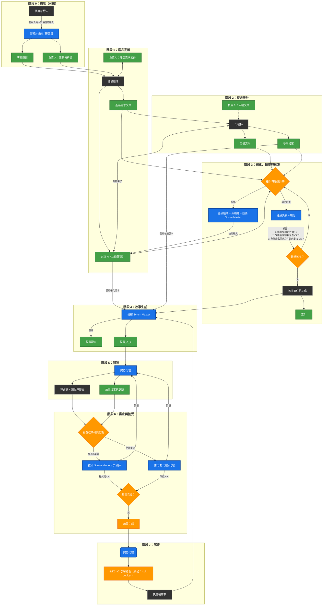

```mermaid
flowchart TD
subgraph subGraph0["階段 0：構思（可選）"]
A1["業務分析師 / 研究員"]
A0["使用者想法"]
A2["專案簡述"]
A3["負責人：業務分析師"]
end
subgraph subGraph1["階段 1：產品定義"]
B1["產品經理"]
B2["產品需求文件"]
B3["史詩 N（功能草稿）"]
B4["負責人：產品需求文件"]
end
subgraph subGraph2["階段 2：技術設計"]
C1["架構師"]
C2["架構文件"]
C3["參考檔案"]
C4["負責人：架構文件"]
end
subgraph subGraph3["階段 3：細化、驗證與核准"]
R1{"細化與驗證計畫"}
R2["產品經理 + 架構師 + 技術 Scrum Master"]
R3["產品負責人驗證"]
R4{"最終核准？"}
R5["核准文件已完成"]
R6["索引"]
end
subgraph subGraph4["階段 4：故事生成"]
E1["技術 Scrum Master"]
E2["故事範本"]
E3["故事_X_Y"]
end
subgraph subGraph5["階段 5：開發"]
F1["開發代理"]
F2["程式碼 + 測試已提交"]
F3["故事檔案已更新"]
end
subgraph subGraph6["階段 6：審查與接受"]
G1{"審查程式碼與功能"}
G1_1["技術 Scrum Master / 架構師"]
G1_2["使用者 / 測試代理"]
G2{"故事完成？"}
G3["故事完成"]
end
subgraph subGraph7["階段 7：部署"]
H1("開發代理")
H2@{ label: "執行 IaC 部署指令（例如：`cdk deploy`）" }
H3["已部署更新"]
end
A0 -- 產品負責人對價值的輸入 --> A1
A1 --> A2 & A3
A2 --> B1
A3 --> B1
B4 <--> B1
B1 --> B2 & B3
B2 --> C1 & R1
B3 <-- 功能需求 --> C1
C4 -.-> C1
C1 --> C2 & C3
B3 --> R1
C2 --> R1
C3 --> R1
R1 -- 協作 --> R2
R2 -- 技術輸入 --> B3
R1 -- 細化計畫 --> R3
R3 -- "檢查：<br>1. 範圍/價值是否 OK？<br>2. 故事順序/依賴是否 OK？<br>3. 整體產品需求文件對齊是否 OK？" --> R4
R4 -- 是 --> R5
R4 -- 否 --> R1
R5 --> R6 & E1
B3 -- 使用細化版本 --> E1
C3 -- 使用核准版本 --> E1
E1 -- 使用 --> E2
E1 --> E3
E3 --> F1
F1 --> F2 & F3
F2 --> G1
F3 --> G1
G1 -- 程式碼審查 --> G1_1
G1 -- 功能審查 --> G1_2
G1_1 -- 回饋 --> F1
G1_2 -- 回饋 --> F1
G1_1 -- 程式碼 OK --> G2
G1_2 -- 功能 OK --> G2
G2 -- 是 --> G3
G3 --> H1
H1 --> H2
H2 --> H3
H3 --> E1

    H2@{ shape: rect}
     A0:::default
     A1:::agent
     A2:::doc
     A3:::doc
     B1:::default
     B2:::doc
     B3:::doc
     B4:::doc
     C1:::default
     C2:::doc
     C3:::doc
     C4:::doc
     F2:::default
     F3:::doc
     H3:::default
     R1:::process
     R2:::agent
     R3:::agent
     R4:::process
     R5:::default
     R6:::doc
     E1:::agent
     E2:::doc
     E3:::doc
     F1:::agent
     G1:::process
     G1_1:::agent
     G1_2:::agent
     G2:::process
     G3:::process
     H1:::agent
     H2:::process
    classDef agent fill:#1a73e8,stroke:#0d47a1,stroke-width:2px,color:white,font-size:14px
    classDef doc fill:#43a047,stroke:#1b5e20,stroke-width:1px,color:white,font-size:14px
    classDef process fill:#ff9800,stroke:#e65100,stroke-width:1px,color:white,font-size:14px
    classDef default fill:#333333,color:white,stroke:#999999,stroke-width:1px,font-size:14px

    %% Styling for subgraphs
    classDef subGraphStyle font-size:16px,font-weight:bold
    class subGraph0,subGraph1,subGraph2,subGraph3,subGraph4,subGraph5,subGraph6,subGraph7 subGraphStyle

    %% Styling for edge labels
    linkStyle default font-size:12px
```
