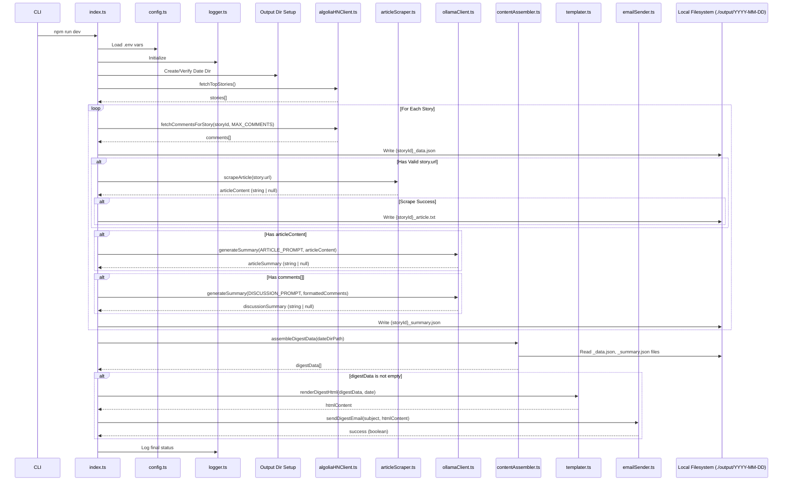

# BMad Hacker Daily Digest 架構文件

## 技術摘要

本文件概述 BMad Hacker Daily Digest 的技術架構。該工具為以 TypeScript 和 Node.js v22 建構的命令列應用，遵循 "bmad-boilerplate" 提供的架構規範。系統每日透過 Algolia HN API 抓取 Hacker News 的前十篇熱門貼文與其留言，嘗試擷取文章內容，並使用本機 Ollama 實例為文章與討論產生摘要。所有中繼資料皆儲存於本機，並於手動執行 CLI 指令時透過 Nodemailer 寄送 HTML 電子報。本架構強調模組化設計，每個處理階段可獨立測試，符合 PRD 要求。MVP 階段僅支援本機執行。

## 高階流程總覽

應用程式採用單一 CLI 指令（`npm run dev` 或 `npm start`）觸發的「順序式資料處理流程」架構。資料依序經過：HN 資料擷取、文章擷取、LLM 摘要產生、電子報組裝與寄送等階段。每個階段會將輸出資料保存至帶有日期標記的資料夾中，後續階段會讀取該資料進行處理。此設計同時支援階段測試工具。

**（Canvas 圖示建議：可視化此流程）**

```mermaid
graph TD
    A[CLI Trigger (npm run dev/start)] --> B(Initialize: Load Config, Setup Logger, Create Output Dir);
    B --> C{Fetch HN Data (Top 10 Stories + Comments)};
    C -- Story/Comment Data --> D(Persist HN Data: ./output/YYYY-MM-DD/{storyId}_data.json);
    D --> E{Attempt Article Scraping (per story)};
    E -- Scraped Text (if successful) --> F(Persist Article Text: ./output/YYYY-MM-DD/{storyId}_article.txt);
    F --> G{Generate Summaries (Article + Discussion via Ollama)};
    G -- Summaries --> H(Persist Summaries: ./output/YYYY-MM-DD/{storyId}_summary.json);
    H --> I{Assemble Digest (Read persisted data)};
    I -- HTML Content --> J{Send Email via Nodemailer};
    J --> K(Log Final Status & Exit);

    subgraph Stage Testing Utilities
        direction LR
        T1[npm run stage:fetch] --> D;
        T2[npm run stage:scrape] --> F;
        T3[npm run stage:summarize] --> H;
        T4[npm run stage:email] --> J;
    end

    C --> |Error/Skip| G;  // If no comments
    E --> |Skip/Fail| G;  // If no URL or scrape fails
    G --> |Summarization Fail| H; // Persist null summaries
    I --> |Assembly Fail| K; // Skip email if assembly fails
```

## 元件視圖

主程式碼位於 `src/` 資料夾中，依模組職責劃分：資料擷取、摘要處理、Email 組裝與寄送等。每個模組獨立，便於測試與維護。

**（Canvas 圖示建議：以 Mermaid 畫出模組與依賴關係）**

```mermaid
graph TD
    subgraph src ["Source Code (src/)"]
        direction LR
        Entry["index.ts (Main Orchestrator)"]

        subgraph Config ["Configuration"]
            ConfMod["config.ts"]
            EnvFile[".env File"]
        end

        subgraph Utils ["Utilities"]
            Logger["logger.ts"]
        end

        subgraph Clients ["External Service Clients"]
            Algolia["clients/algoliaHNClient.ts"]
            Ollama["clients/ollamaClient.ts"]
        end

        Scraper["scraper/articleScraper.ts"]

        subgraph Email ["Email Handling"]
            Assembler["email/contentAssembler.ts"]
            Templater["email/templater.ts (or within Assembler)"]
            Sender["email/emailSender.ts"]
            Nodemailer["(nodemailer library)"]
        end

        subgraph Stages ["Stage Testing Scripts (src/stages/)"]
             FetchStage["fetch_hn_data.ts"]
             ScrapeStage["scrape_articles.ts"]
             SummarizeStage["summarize_content.ts"]
             SendStage["send_digest.ts"]
        end

        Entry --> ConfMod;
        Entry --> Logger;
        Entry --> Algolia;
        Entry --> Scraper;
        Entry --> Ollama;
        Entry --> Assembler;
        Entry --> Templater;
        Entry --> Sender;

        Algolia -- uses --> NativeFetch["Node.js v22 Native Workspace"];
        Ollama -- uses --> NativeFetch;
        Scraper -- uses --> NativeFetch;
        Scraper -- uses --> ArticleExtractor["(@extractus/article-extractor)"];
        Sender -- uses --> Nodemailer;
        ConfMod -- reads --> EnvFile;

        Assembler -- reads --> LocalFS["Local Filesystem (./output)"];
        Entry -- writes --> LocalFS;

        FetchStage --> Algolia;
        FetchStage --> LocalFS;
        ScrapeStage --> Scraper;
        ScrapeStage --> LocalFS;
        SummarizeStage --> Ollama;
        SummarizeStage --> LocalFS;
        SendStage --> Assembler;
        SendStage --> Templater;
        SendStage --> Sender;
        SendStage --> LocalFS;
    end

    CLI["CLI (npm run ...)"] --> Entry;
    CLI -- runs --> FetchStage;
    CLI -- runs --> ScrapeStage;
    CLI -- runs --> SummarizeStage;
    CLI -- runs --> SendStage;

```



_Module 模組說明：_

- **`src/index.ts`**：主要進入點，負責協調整體流程，從初始化到發送 Email。
- **`src/config.ts`**：載入與驗證 `.env` 環境變數。
- **`src/logger.ts`**：簡易日誌工具，全域使用。
- **`src/clients/algoliaHNClient.ts`**：封裝與 Algolia HN API 的互動。
- **`src/clients/ollamaClient.ts`**：封裝與本地 Ollama API 的互動。
- **`src/scraper/articleScraper.ts`**：負責抓取文章 HTML 並抽取內文。
- **`src/email/contentAssembler.ts`**：讀取本地儲存的 story 資料與摘要。
- **`src/email/templater.ts`**：組裝並渲染 HTML email 內容。
- **`src/email/emailSender.ts`**：設定與寄送 Email。
- **`src/stages/*.ts`**：單一階段測試腳本，可獨立執行。

## 核心架構決策與設計模式

- **Pipeline 架構：** 每個階段串接資料處理，透過本地檔案傳遞資料，方便除錯與獨立測試。
- **本地執行與檔案儲存：** 不依賴資料庫，所有中繼資料儲存於 `./output` 資料夾，便於追蹤。
- **原生 Workspace API：** 所有 HTTP 請求（如 Algolia、Ollama）均使用 Node.js 原生支援。
- **模組化 Clients：** 外部 API 封裝於 `clients/` 中，利於後續替換或擴充。
- **`.env` 組態管理：** 採用標準 `.env` 檔案與 dotenv 套件管理。
- **階段測試腳本：** 提供獨立測試每個階段的 CLI 工具（如抓取、擷取、摘要、寄送）。
- **錯誤容忍（擷取階段）：** 若擷取失敗，仍可寄送只有留言摘要的報告，符合容錯要求。

## 核心工作流程／簡化時序圖

**（Canvas 圖示建議：轉換為時序圖顯示模組交互）**



## 基礎建設與部署概述

- **雲端供應商：** 無（MVP 僅限本機執行）
- **基礎服務：** 無
- **IaC：** 無
- **部署策略：** 手動執行 CLI（開發用 `npm run dev`，正式版用 `npm run build && npm start`）
- **環境：** 單一本地開發機

## 參考文件

- docs/prd.md
- docs/epic1-draft.txt, docs/epic2-draft.txt, ... docs/epic5-draft.txt
- docs/tech-stack.md
- docs/project-structure.md
- docs/coding-standards.md
- docs/api-reference.md
- docs/data-models.md
- docs/environment-vars.md
- docs/testing-strategy.md

## 變更紀錄

| 變更內容 | 日期       | 版本 | 說明                       | 作者        |
| -------- | ---------- | ---- | -------------------------- | ----------- |
| 初始草稿 | 2025-05-04 | 0.1  | 根據 PRD 與 Epics 撰寫草稿 | 3-Architect |
