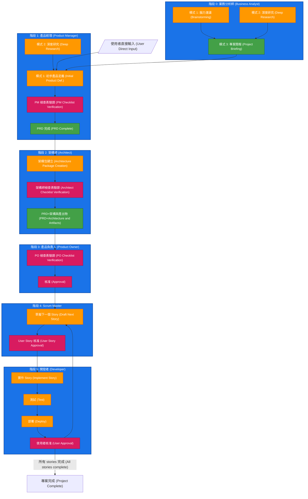

```mermaid
flowchart TD
%% Phase 0: BA
subgraph BA["階段 0: 業務分析師 (Business Analyst)"]
BA_B["模式 1: 腦力激盪 (Brainstorming)"]
BA_R["模式 2: 深度研究 (Deep Research)"]
BA_P["模式 3: 專案簡報 (Project Briefing)"]

        BA_B --> BA_P
        BA_R --> BA_P
    end

    %% Phase 1: PM
    subgraph PM["階段 1: 產品經理 (Product Manager)"]
        PM_D["模式 2: 深度研究 (Deep Research)"]
        PM_M["模式 1: 初步產品定義 (Initial Product Def.)"]
        PM_C["PM 檢查表驗證 (PM Checklist Verification)"]
        PM_PRD["PRD 完成 (PRD Complete)"]

        PM_D --> PM_M
        PM_M --> PM_C
        PM_C --> PM_PRD
    end

    %% Phase 2: Architect
    subgraph ARCH["階段 2: 架構師 (Architect)"]
        ARCH_P["架構包建立 (Architecture Package Creation)"]
        ARCH_C["架構師檢查表驗證 (Architect Checklist Verification)"]
        ARCH_D["PRD+架構與產出物 (PRD+Architecture and Artifacts)"]

        ARCH_P --> ARCH_C
        ARCH_C --> ARCH_D
    end

    %% Phase 3: PO
    subgraph PO["階段 3: 產品負責人 (Product Owner)"]
        PO_C["PO 檢查表驗證 (PO Checklist Verification)"]
        PO_A["核准 (Approval)"]
    end

    %% Phase 4: SM
    subgraph SM["階段 4: Scrum Master"]
        SM_S["草擬下一個 Story (Draft Next Story)"]
        SM_A["User Story 核准 (User Story Approval)"]
    end

    %% Phase 5: Developer
    subgraph DEV["階段 5: 開發者 (Developer)"]
        DEV_I["實作 Story (Implement Story)"]
        DEV_T["測試 (Test)"]
        DEV_D["部署 (Deploy)"]
        DEV_A["使用者核准 (User Approval)"]

        DEV_I --> DEV_T
        DEV_T --> DEV_D
        DEV_D --> DEV_A
    end

    %% Connections between phases
    BA_P --> PM_M
    User_Input[/"使用者直接輸入 (User Direct Input)"/] --> PM_M
    PM_PRD --> ARCH_P
    ARCH_D --> PO_C
    PO_C --> PO_A
    PO_A --> SM_S
    SM_S --> SM_A
    SM_A --> DEV_I
    DEV_A --> SM_S

    %% Completion condition
    DEV_A -- "所有 stories 完成 (All stories complete)" --> DONE["專案完成 (Project Complete)"]

    %% Styling
    classDef phase fill:#1a73e8,stroke:#0d47a1,stroke-width:2px,color:white,font-size:14px
    classDef artifact fill:#43a047,stroke:#1b5e20,stroke-width:1px,color:white,font-size:14px
    classDef process fill:#ff9800,stroke:#e65100,stroke-width:1px,color:white,font-size:14px
    classDef approval fill:#d81b60,stroke:#880e4f,stroke-width:1px,color:white,font-size:14px

    class BA,PM,ARCH,PO,SM,DEV phase
    class BA_P,PM_PRD,ARCH_D artifact
    class BA_B,BA_R,PM_D,PM_M,ARCH_P,SM_S,DEV_I,DEV_T,DEV_D process
    class PM_C,ARCH_C,PO_C,PO_A,SM_A,DEV_A approval
```
